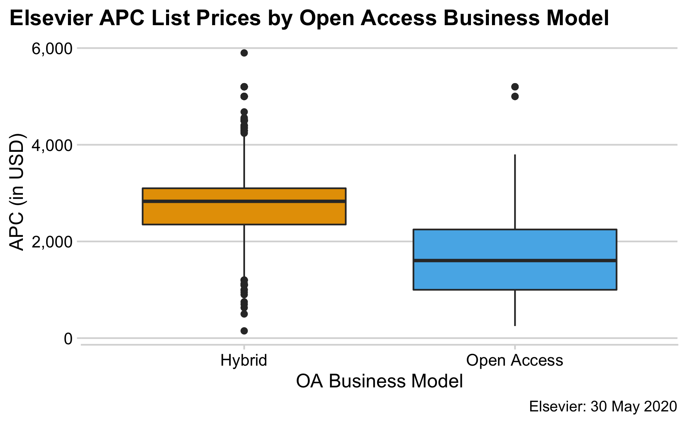

## Portfolio overview

### Load mined data


```r
library(tidyverse)
library(here)
els_jns_df <- readr::read_csv(here::here("data", "elsevier_apc_list.csv"))
```

### Journals per business model


```r
els_jns_df %>%
  count(oa_type) %>%
  mutate(prop = n / sum(n))
#> # A tibble: 2 x 3
#>   oa_type         n  prop
#>   <chr>       <int> <dbl>
#> 1 Hybrid       1982 0.847
#> 2 Open Access   358 0.153
```

### List prices per business model 

Only journals with APC in USD considered


```r
els_jns_df %>%
 # filter(apc_currency == "USD") %>%
  group_by(oa_type, apc_currency) %>%
  summarise(n_journals = n(),
            mean_apc = mean(apc, na.rm = TRUE),
            sd = sd(apc, na.rm = TRUE)) %>%
  arrange(desc(apc_currency))
#> # A tibble: 4 x 5
#> # Groups:   oa_type [2]
#>   oa_type     apc_currency n_journals mean_apc    sd
#>   <chr>       <chr>             <int>    <dbl> <dbl>
#> 1 Hybrid      USD                1877    2767.  697.
#> 2 Open Access USD                 338    1752.  965.
#> 3 Hybrid      EUR                 105    1980.  602.
#> 4 Open Access EUR                  20    1866   654.
```

```r
els_jns_df %>%
  filter(apc_currency == "USD") %>%
  ggplot(aes(oa_type, apc, fill = oa_type)) +
  geom_boxplot() +
  scale_y_continuous(labels = scales::number_format(big.mark = ",")) +
  colorblindr::scale_fill_OkabeIto() +
  cowplot::theme_minimal_hgrid(12) +
  theme(legend.position = "none", 
        plot.title.position = "plot") +
  labs(x = "OA Business Model", y = "APC (in USD)",
       title = "Elsevier APC List Prices by Open Access Business Model",
       caption = "Elsevier: 30 May 2020")
```


