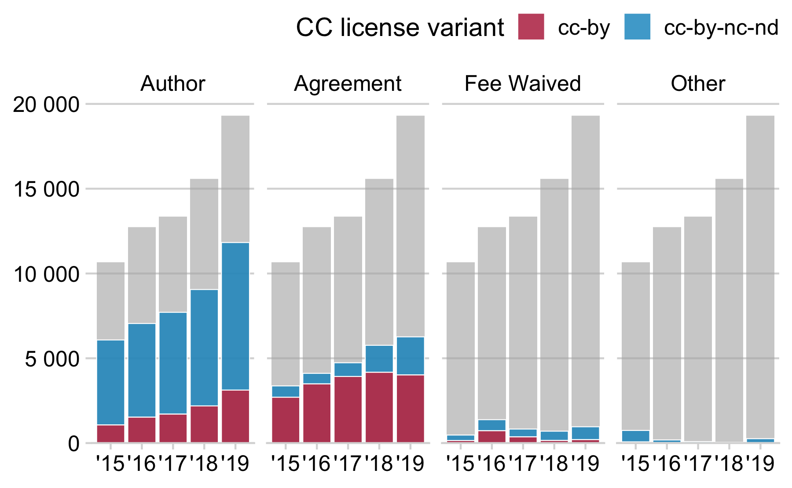

invoice analysis
================

In most cases, Elsevier sent invoices for hybrid open access publication
fees to individual authors ( 58%). For around 34% of articles, the
publisher directly billed funders and research organisations. The
proportion of open access articles where Elsevier granted publication
fee waivers was 6%.

Figure @ref(fig:invoiceoverview) shows the annual development per
invoicing type. Each type is visualised separately as parts of the
total. The grey areas show the overall yearly distribution of open
access articles in hybrid journals, and the proportion of each invoicing
type is highlighted in blue, The figure reveals a general growth of open
access articles in hybrid journals. It illustrates that this development
was mainly driven by billing individual authors, while central invoicing
stagnated. Also, the amount of fee-waived articles remained more or less
constant from 2015 to date.

Development of fee-based open access publishing in Elsevier hybrid
journals by invoicing type. Colored bars represent the invoice
recipient, or whether the fee was waived. Grey bars show the total
number of hybrid open access articles published in Elsevier journals
from 2015 to date.

In terms of re-use, the type of invoicing is strongly related to whether
the open content license permits commercial adaption or not (see
figure). Although most open access articles published in Elsevier’s
hybrid journals were billed to authors directly, centrally invoiced
articles accounted for the largest share of articles under an CC BY
licenses ( 62%). Consequently, 76% of centrally invoiced articles
permits commercial adaption.

Next, we examined funders and research organisations that were invoiced
directly by Elsevier. In total, we were able to identify 70 sponsoring
bodies. Figure presents a breakdown by country, highlighting the
dominating role of a few countries. Not surprisingly, mostly British
funders paid for hybrid open access in Elsevier hybrid journals ( 59%),
followed by funding bodies from the European Commission ( 13%) and the
Netherlands ( 12%). In the latter case, invoices for individual open
access articles were not send to research funders, but to the Dutch
VSNU, a consortium of Universities in the Netherlands that has
negotiated agreements with Elsevier since 2016. The prominent role of
Norway can be also explained by a national deal, which started in 2019.
US-based open access sponsors originated mainly from the Bill & Melinda
Gates Foundation (n = 1,031).

### table representation

<!--html_preserve-->

<table class="gt_table" style="table-layout: fixed;">

<colgroup>

<col/>

<col style="width:80px;"/>

<col style="width:80px;"/>

<col style="width:80px;"/>

<col style="width:80px;"/>

<col style="width:80px;"/>

</colgroup>

<thead class="gt_col_headings">

<tr>

<th class="gt_col_heading gt_center gt_columns_bottom_border" rowspan="2" colspan="1" style="color: black; font-weight: bold;">

OA Sponsor

</th>

<th class="gt_col_heading gt_center gt_columns_bottom_border" rowspan="2" colspan="1" style="color: black; font-weight: bold;">

Journals

</th>

<th class="gt_col_heading gt_center gt_columns_bottom_border" rowspan="2" colspan="1" style="color: black; font-weight: bold;">

Articles

</th>

<th class="gt_col_heading gt_center gt_columns_bottom_border" rowspan="2" colspan="1" style="color: black; font-weight: bold;">

%

</th>

<th class="gt_center gt_columns_top_border gt_column_spanner_outer" rowspan="1" colspan="2">

<strong>Compliance</strong>

</th>

</tr>

<tr>

<th class="gt_col_heading gt_columns_bottom_border gt_center" rowspan="1" colspan="1" style="color: black; font-weight: bold;">

CC-BY

</th>

<th class="gt_col_heading gt_columns_bottom_border gt_center" rowspan="1" colspan="1" style="color: black; font-weight: bold;">

OAPC

</th>

</tr>

</thead>

<tbody class="gt_table_body">

<tr>

<td class="gt_row gt_left">

Engineering and Physical Sciences Research Council

</td>

<td class="gt_row gt_right">

622

</td>

<td class="gt_row gt_right">

4,666

</td>

<td class="gt_row gt_right">

19%

</td>

<td class="gt_row gt_right" style="background-color: #891F71; color: #FFFFFF;">

97%

</td>

<td class="gt_row gt_right" style="background-color: #BE287A; color: #FFFFFF;">

55%

</td>

</tr>

<tr>

<td class="gt_row gt_left">

VSNU1

</td>

<td class="gt_row gt_right">

358

</td>

<td class="gt_row gt_right">

2,836

</td>

<td class="gt_row gt_right">

12%

</td>

<td class="gt_row gt_right" style="background-color: #F38070; color: #000000;">

52%

</td>

<td class="gt_row gt_right" style="background-color: #FCDE9C; color: #000000;">

0%

</td>

</tr>

<tr>

<td class="gt_row gt_left">

Wellcome Trust

</td>

<td class="gt_row gt_right">

446

</td>

<td class="gt_row gt_right">

2,471

</td>

<td class="gt_row gt_right">

10%

</td>

<td class="gt_row gt_right" style="background-color: #881F71; color: #FFFFFF;">

98%

</td>

<td class="gt_row gt_right" style="background-color: #881F71; color: #FFFFFF;">

66%

</td>

</tr>

<tr>

<td class="gt_row gt_left">

European Research Council

</td>

<td class="gt_row gt_right">

543

</td>

<td class="gt_row gt_right">

1,990

</td>

<td class="gt_row gt_right">

8%

</td>

<td class="gt_row gt_right" style="background-color: #FCDE9C; color: #000000;">

32%

</td>

<td class="gt_row gt_right" style="background-color: #FBB480; color: #000000;">

8%

</td>

</tr>

<tr>

<td class="gt_row gt_left">

Medical Research Council

</td>

<td class="gt_row gt_right">

384

</td>

<td class="gt_row gt_right">

1,922

</td>

<td class="gt_row gt_right">

8%

</td>

<td class="gt_row gt_right" style="background-color: #942073; color: #FFFFFF;">

95%

</td>

<td class="gt_row gt_right" style="background-color: #CD3078; color: #FFFFFF;">

51%

</td>

</tr>

<tr>

<td class="gt_row gt_left">

Natural Environment Research Council

</td>

<td class="gt_row gt_right">

203

</td>

<td class="gt_row gt_right">

1,357

</td>

<td class="gt_row gt_right">

6%

</td>

<td class="gt_row gt_right" style="background-color: #8C1F72; color: #FFFFFF;">

97%

</td>

<td class="gt_row gt_right" style="background-color: #DD3B76; color: #FFFFFF;">

45%

</td>

</tr>

<tr>

<td class="gt_row gt_left">

Biotechnology and Biological Sciences Research Council

</td>

<td class="gt_row gt_right">

309

</td>

<td class="gt_row gt_right">

1,169

</td>

<td class="gt_row gt_right">

5%

</td>

<td class="gt_row gt_right" style="background-color: #9F2275; color: #FFFFFF;">

93%

</td>

<td class="gt_row gt_right" style="background-color: #DF4174; color: #FFFFFF;">

41%

</td>

</tr>

<tr>

<td class="gt_row gt_left">

Bill & Melinda Gates Foundation

</td>

<td class="gt_row gt_right">

255

</td>

<td class="gt_row gt_right">

1,031

</td>

<td class="gt_row gt_right">

4%

</td>

<td class="gt_row gt_right" style="background-color: #7C1D6F; color: #FFFFFF;">

100%

</td>

<td class="gt_row gt_right" style="background-color: #7C1D6F; color: #FFFFFF;">

68%

</td>

</tr>

<tr>

<td class="gt_row gt_left">

Economic and Social Research Council

</td>

<td class="gt_row gt_right">

245

</td>

<td class="gt_row gt_right">

922

</td>

<td class="gt_row gt_right">

4%

</td>

<td class="gt_row gt_right" style="background-color: #922073; color: #FFFFFF;">

96%

</td>

<td class="gt_row gt_right" style="background-color: #D53578; color: #FFFFFF;">

48%

</td>

</tr>

<tr>

<td class="gt_row gt_left">

Norway Institutes1

</td>

<td class="gt_row gt_right">

374

</td>

<td class="gt_row gt_right">

694

</td>

<td class="gt_row gt_right">

3%

</td>

<td class="gt_row gt_right" style="background-color: #FBB07E; color: #000000;">

41%

</td>

<td class="gt_row gt_right" style="background-color: #FCDE9C; color: #000000;">

0%

</td>

</tr>

<tr>

<td class="gt_row gt_left">

Other

</td>

<td class="gt_row gt_right">

1,019

</td>

<td class="gt_row gt_right">

5,219

</td>

<td class="gt_row gt_right">

21%

</td>

<td class="gt_row gt_right" style="background-color: #F0756E; color: #000000;">

54%

</td>

<td class="gt_row gt_right" style="background-color: #F1796F; color: #000000;">

22%

</td>

</tr>

<tr>

<td class="gt_row gt_left" style="border-top-width: 2px; border-top-style: solid; border-top-color: black;">

All

</td>

<td class="gt_row gt_right" style="border-top-width: 2px; border-top-style: solid; border-top-color: black;">

1,429

</td>

<td class="gt_row gt_right" style="border-top-width: 2px; border-top-style: solid; border-top-color: black;">

24,277

</td>

<td class="gt_row gt_right" style="border-top-width: 2px; border-top-style: solid; border-top-color: black;">

100%

</td>

<td class="gt_row gt_right" style="background-color: #DD3D76; color: #FFFFFF; border-top-width: 2px; border-top-style: solid; border-top-color: black;">

76%

</td>

<td class="gt_row gt_right" style="background-color: #E24C70; color: #000000; border-top-width: 2px; border-top-style: solid; border-top-color: black;">

36%

</td>

</tr>

</tbody>

<tfoot>

<tr class="gt_footnotes">

<td colspan="6">

 <em>1</em> 

Transformative  

</td>

</tr>

</tfoot>

</table>

<!--/html_preserve-->
