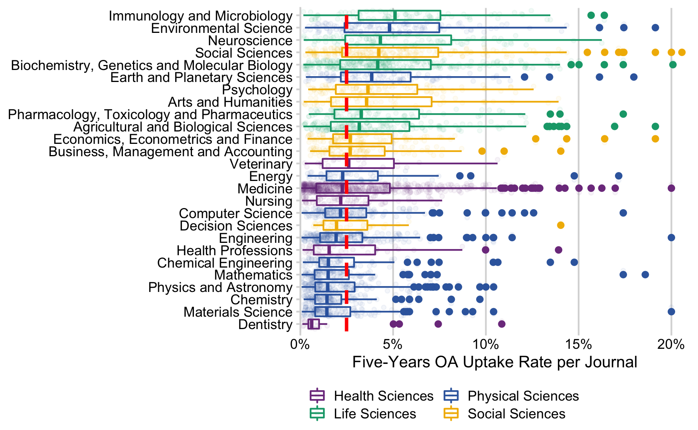

``` r
# libraries
library(tidyverse)
library(here)
library(cowplot)
library(gt)
library(janitor)
```

``` r
hybrid_volume <- readr::read_csv(here::here("data", "hybrid_volume_eligible.csv"))
```

``` r
ind_per_jn <- hybrid_volume %>%
  group_by(issn, container_title, articles, issued_year) %>%
  summarise(n = n_distinct(doi)) %>%
  mutate(prop = n / articles)
```

read in scopus journal indicators

``` r
scopus_19 <- readxl::read_excel(here::here("data", "scopus_jn.xlsx"), sheet = 2,
                                .name_repair = make_clean_names)
```

normalize scopus jn indicators

``` r
scopus_norm <- scopus_19 %>%
  gather(print_issn, e_issn, key = "issn_tpye", value = "issn") %>%
  # trailing zero's missing in Excel spreadsheet
  mutate(
    issn = ifelse(nchar(issn) == 5, paste0("000", issn), issn),
    issn = ifelse(nchar(issn) == 6, paste0("00", issn), issn),
    issn = ifelse(nchar(issn) == 7, paste0("0", issn), issn)) %>%
  # missing hyphen
  mutate(issn = map_chr(issn, function(x) paste(c(substr(x, 1, 4), substr(x, 5, 8)), collapse = "-")))
```

missing journals (needs to be validated)

``` r
hybrid_volume %>% 
  filter(!issn %in% scopus_norm$issn) %>% 
  distinct(issn, container_title)
#> # A tibble: 22 x 2
#>    issn      container_title                                       
#>    <chr>     <chr>                                                 
#>  1 0045-7825 Computer Methods in Applied Mechanics and Engineering 
#>  2 0094-114X Mechanism and Machine Theory                          
#>  3 0304-4165 Biochimica et Biophysica Acta (BBA) - General Subjects
#>  4 0301-7516 International Journal of Mineral Processing           
#>  5 0300-9440 Progress in Organic Coatings                          
#>  6 1878-786X Journal de Chirurgie Viscérale                        
#>  7 1359-5113 Process Biochemistry                                  
#>  8 2387-0206 Medicina Clínica (English Edition)                    
#>  9 0020-7063 The International Journal of Accounting               
#> 10 0968-0004 Trends in Biochemical Sciences                        
#> # … with 12 more rows
```

backup

``` r
cite_score_19 <- scopus_norm %>% 
  select(issn, contains("subject"), percentile, snip, sjr)
write_csv(cite_score_19, here::here("data", "cite_score_19.csv"))
```

``` r
ajsc_mapped <- read_csv(here::here("data", "asjc_mapped.csv")) %>%
  mutate(top_level_code = as.character(top_level_code))
hybrid_subject <- left_join(ind_per_jn, cite_score_19, by = c("issn" = "issn")) %>%
  mutate(top_level_code = substr(as.character(scopus_asjc_code_sub_subject_area), 1, 2)) %>%
  inner_join(ajsc_mapped, by = "top_level_code")
# back up ind
 write_csv(hybrid_subject, here::here("data", "jn_scopus_ind_subjects.csv"))
# backup subject liste
hybrid_subject %>% 
  ungroup() %>% 
  distinct(issn, container_title, subject_area, top_level = description) %>%
  write_csv(here::here("data", "jn_subjects.csv"))
```

### Correlation test

``` r
hybrid_subject_19 <- hybrid_subject %>% 
  filter(issued_year == "2019", !is.na(percentile)
         #, prop > 0.01 & prop < 0.15) 
         )%>%
  distinct(issn, prop, percentile, snip, sjr)
```

spearman

``` r
cor.test(hybrid_subject_19$prop, hybrid_subject_19$snip, method = "spearman")
#> 
#>  Spearman's rank correlation rho
#> 
#> data:  hybrid_subject_19$prop and hybrid_subject_19$snip
#> S = 7960345441, p-value = 0.0000000000000005
#> alternative hypothesis: true rho is not equal to 0
#> sample estimates:
#>    rho 
#> 0.1309
```

plot

``` r
ggplot(hybrid_subject_19, aes(prop, snip)) + geom_point(alpha = .3) + geom_smooth(method = "lm") +
  coord_cartesian(xlim = c(0., 0.7), ylim = c(0.5, 6)) +
  labs(x = "OA Uptake Rate", y = "SNIP") +
  theme_cowplot()
```


  - cell system, global food security

<!-- end list -->

``` r
hybrid_subject %>%
  filter(issued_year == "2019", !is.na(percentile)) %>% 
  ggplot(aes(prop, snip)) + geom_point(alpha = .3) + geom_smooth(method = "lm") +
  facet_wrap(~top_level_code, scales = "free") +
  theme_minimal()
```



## OA proportion per subject

``` r
# sort by median per asjc subject group
subject_all_years <- hybrid_subject %>% 
  ungroup() %>% 
  group_by(issn, description, subject_area) %>% 
  summarise(n_oa = sum(n),
            n = sum(articles)) %>%
  ungroup() %>%
  group_by(description) %>%
  filter(subject_area != "Multidisciplinary")

median_all <- subject_all_years %>% 
  ungroup() %>% 
  distinct(issn, .keep_all = TRUE) %>% 
  mutate(prop = n_oa /n) %>% 
  .$prop %>% 
  median()

ggplot(subject_all_years, aes(fct_reorder(description, n_oa / n, .fun = median), n_oa / n)) + 
  geom_boxplot(aes(color = subject_area)) +
  geom_jitter(alpha = .05, aes(color = subject_area), size = 1) +
  geom_hline(yintercept = median_all,  colour = "red", linetype ="dashed", size = 1) +
  scale_colour_manual(NULL, values = c("#7F3C8D", "#11A579", "#3969AC", "#F2B701")) +
  scale_y_continuous(
    labels = scales::percent_format(accuracy = 5L),
    expand = expansion(mult = c(0, 0.05))
  ) +
  coord_flip(ylim=c(0,0.2)) +
  labs(x = NULL, y = "Five-Years OA Uptake Rate per Journal") +
  theme_minimal_vgrid(font_size = 10) +
  theme(legend.position = "bottom") +
  guides(color = guide_legend(ncol = 2))
```


  - Comptes Rendus
    <https://www.library.illinois.edu/mtx/2020/05/01/comptes-rendus-de-lacademie-des-sciences-important-publishing-and-access-changes/>

### by funder

``` r
jn_subjects <- read_csv(here::here("data", "jn_subjects.csv"))

hybrid_volume_subjects <- hybrid_volume %>%
  group_by(oa_sponsor_type, articles, issued_year, issn) %>% 
  summarise(n_oa = n_distinct(doi)) %>% 
  left_join(jn_subjects, by = "issn") %>%
  ungroup()

hybrid_volume_subjects %>%
 # filter(container_title == "Journal of the American College of Cardiology") %>%
  group_by(top_level, articles, issued_year) %>%
  summarise(n_oa = sum(n_oa)) %>%
  ungroup() %>%
  group_by(top_level) %>%
  summarise(n_oa = sum(n_oa),
            n = sum(articles), .groups = "drop") %>%
  mutate(prop = n_oa / n) %>%
  arrange(desc(prop))
#> # A tibble: 28 x 4
#>    top_level                                     n_oa      n   prop
#>    <chr>                                        <int>  <dbl>  <dbl>
#>  1 Veterinary                                    2091  25292 0.0827
#>  2 Social Sciences                               6317  80535 0.0784
#>  3 Arts and Humanities                           1565  23795 0.0658
#>  4 Immunology and Microbiology                   5530  87145 0.0635
#>  5 Earth and Planetary Sciences                  4545  94792 0.0479
#>  6 Psychology                                    3052  64691 0.0472
#>  7 Agricultural and Biological Sciences          8044 175069 0.0459
#>  8 Biochemistry, Genetics and Molecular Biology 15881 349356 0.0455
#>  9 Economics, Econometrics and Finance           2071  46940 0.0441
#> 10 Neuroscience                                  5846 132617 0.0441
#> # … with 18 more rows


# hybrid_volume %>%
#   left_join(jn_subjects, by = "issn") %>%
#   group_by(oa_sponsor_type, issn, issued_year, top_level, articles) %>%
#   summarise(n_oa = n_distinct(doi)) %>%
#   group_by(oa_sponsor_type, issued_year, top_level) %>%
#   summarise(n_oa = sum(n_oa),
#             n = sum(articles)) %>%
#   ungroup() %>%
#   group_by(top_level, oa_sponsor_type) %>%
#   summarise(n_oa = sum(n_oa, na.rm = TRUE),
#             n = sum(n, na.rm = TRUE)) %>%
#   mutate(prop = n_oa / n) %>% View()
# 
# 
# hybrid_volume %>%
#   left_join(jn_subjects, by = "issn") %>%
#   group_by(issn, issued_year, top_level, article) %>%
#   summarise(n_oa = n_distinct(doi)) %>%
#   group_by(issued_year, top_level) %>%
#   summarise(nn = sum(n_oa))
```

``` r
hybrid_volume_jn <- hybrid_volume %>%
  group_by(issn) %>%
  summarise(n_oa = n_distinct(doi))

share_per_invoicing_type <- hybrid_volume %>%
  group_by(oa_sponsor_type, issn) %>%
  summarise(n_oa_type = n_distinct(doi)) %>%
  left_join(hybrid_volume_jn, by = "issn") %>%
  mutate(prop = n_oa_type / n_oa) %>%
  left_join(jn_subjects, by = "issn") %>%
  ungroup()
share_per_invoicing_type %>%
  filter(oa_sponsor_type == c("FundingBody")) %>%
  ggplot(aes(fct_reorder(top_level, prop, .fun = median, .desc = TRUE), prop)) +
  geom_boxplot() +
  coord_flip()
```


``` r
funder_shares <- hybrid_volume %>%
   mutate(oa_sponsor_type = ifelse(!oa_sponsor_type %in% c("FundingBody", "Author", "ElsevierWaived"), "Other", oa_sponsor_type)) %>%
  mutate(oa_sponsor_type = recode(oa_sponsor_type, 
                                  `FundingBody` = "Agreement",
                                  `ElsevierWaived` = "Fee Waived")) %>%
  group_by(oa_sponsor_type, issn) %>%
  summarise(n_oa_type = n_distinct(doi)) %>%
  left_join(hybrid_volume_jn, by = "issn") %>%
  mutate(prop = n_oa_type / n_oa) %>%
  left_join(jn_subjects, by = "issn") %>%
  ungroup() %>%
  group_by(top_level, oa_sponsor_type) %>%
  summarise(oa_type = sum(n_oa_type)) %>%
  mutate(prop = oa_type / sum(oa_type))
# overall props
oa_sponsor_type_all <- hybrid_volume %>% 
  #exclude multidisciplinary
  filter(issn != "2095-9273") %>%
  count(oa_sponsor_type) %>% 
  mutate(prop = n / sum(n))

funder_shares %>% 
  filter(oa_sponsor_type %in% c("Author", "Agreement"), top_level != "Multidisciplinary") %>%
  pivot_wider(id_cols = top_level, names_from = oa_sponsor_type, values_from = prop) %>%
  filter(!is.na(top_level)) %>%
  ggplot() +
   ggalt::geom_dumbbell(
    aes(y = reorder(top_level, Author), x = Agreement, xend = Author),
    colour = "grey20",
    colour_xend = "#EDAE49",
    colour_x = "#30638E",
    size_x = 1.5,
    alpha = 0.9,
    size_xend = 1.5,
    show.legend = TRUE
   ) +
  geom_vline(xintercept = oa_sponsor_type_all %>% filter(oa_sponsor_type == "Author") %>% .$prop,  colour = "#EDAE49", linetype ="dashed", size = 1) +
    geom_vline(xintercept = oa_sponsor_type_all %>% filter(oa_sponsor_type == "FundingBody") %>% .$prop,  colour = "#30638E", linetype ="dashed", size = 1) +
  scale_x_continuous(
    labels = scales::percent_format(accuracy = 5L),
    expand = expansion(mult = c(0, 0.05)),
    limits = c(0,1)
  ) +
  labs(y = NULL, x = "Percentage Invoicing Type") +
  theme_minimal_vgrid(font_size = 10)
```


issues:

  - high share of elseveir waived articles due to ome issue published in
    Nuclear and Particle Physics Proceedings: “37th International
    Conference on High Energy Physics (ICHEP) (ICHEP 2014)2-9 July 2014,
    Valencia, Spain” Do we want to exclude this journal?

table representation

``` r
subject_all <- funder_shares %>%
  group_by(top_level) %>%
  summarise(oa = sum(oa_type))
funder_overview_subject <- left_join(funder_shares, subject_all, by = "top_level")
# gt
funder_overview_subject %>%
  pivot_wider(id_cols = c("top_level", "oa"), names_from = oa_sponsor_type, values_from = prop) %>%
  ungroup() %>% 
  # remove na and multidisciplinary 
  filter(!is.na(top_level), top_level != "Multidisciplinary") %>%
  relocate(Agreement, .after = Author) %>%
  arrange(desc(Author)) %>%
  gt::gt(rowname_col = "top_level") %>%
  gt::cols_label(oa = "OA Articles") %>%
  fmt_percent(
    columns = vars(Author, Agreement, `Fee Waived`, Other),
    decimals = 0) %>%
  cols_width(
    2:6 ~ px(80)) %>%
  cols_align(
    align = "right",
    columns = 2:6
  ) %>%
  cols_width(
    2 ~ px(120)
  ) %>%
    gt::cols_align(
    align = "left",
    columns = 1
  ) %>%
  fmt_number(
    columns = vars(oa),
    decimals = 0
  ) %>%
  data_color(
    columns =3:6,
    colors = scales::col_numeric(
      # custom defined values - notice that order matters!
      palette = c("white", "#fcde9c","#faa476","#f0746e","#e34f6f","#dc3977","#b9257a","#7c1d6f"),
      domain = NULL
    )
  ) %>%
  tab_spanner(
    label = md("**OA Sponsor Type**"),
    columns = 3:6
  ) %>%
    tab_style(
    style = cell_text(color = "black", weight = "bold"),
    locations = list(
      cells_column_labels(everything())
    )) %>%
   tab_options(
    column_labels.border.top.color = "white",
    column_labels.border.top.width = px(3),
    column_labels.border.bottom.color = "black",
    table_body.hlines.color = "white",
    table.border.bottom.color = "white",
    table.border.bottom.width = px(3)
      )
```

<!--html_preserve-->

<style>html {
  font-family: -apple-system, BlinkMacSystemFont, 'Segoe UI', Roboto, Oxygen, Ubuntu, Cantarell, 'Helvetica Neue', 'Fira Sans', 'Droid Sans', Arial, sans-serif;
}

#uvheltmgoi .gt_table {
  display: table;
  border-collapse: collapse;
  margin-left: auto;
  margin-right: auto;
  color: #333333;
  font-size: 16px;
  font-weight: normal;
  font-style: normal;
  background-color: #FFFFFF;
  width: auto;
  border-top-style: solid;
  border-top-width: 2px;
  border-top-color: #A8A8A8;
  border-right-style: none;
  border-right-width: 2px;
  border-right-color: #D3D3D3;
  border-bottom-style: solid;
  border-bottom-width: 3px;
  border-bottom-color: white;
  border-left-style: none;
  border-left-width: 2px;
  border-left-color: #D3D3D3;
}

#uvheltmgoi .gt_heading {
  background-color: #FFFFFF;
  text-align: center;
  border-bottom-color: #FFFFFF;
  border-left-style: none;
  border-left-width: 1px;
  border-left-color: #D3D3D3;
  border-right-style: none;
  border-right-width: 1px;
  border-right-color: #D3D3D3;
}

#uvheltmgoi .gt_title {
  color: #333333;
  font-size: 125%;
  font-weight: initial;
  padding-top: 4px;
  padding-bottom: 4px;
  border-bottom-color: #FFFFFF;
  border-bottom-width: 0;
}

#uvheltmgoi .gt_subtitle {
  color: #333333;
  font-size: 85%;
  font-weight: initial;
  padding-top: 0;
  padding-bottom: 4px;
  border-top-color: #FFFFFF;
  border-top-width: 0;
}

#uvheltmgoi .gt_bottom_border {
  border-bottom-style: solid;
  border-bottom-width: 2px;
  border-bottom-color: #D3D3D3;
}

#uvheltmgoi .gt_col_headings {
  border-top-style: solid;
  border-top-width: 3px;
  border-top-color: white;
  border-bottom-style: solid;
  border-bottom-width: 2px;
  border-bottom-color: black;
  border-left-style: none;
  border-left-width: 1px;
  border-left-color: #D3D3D3;
  border-right-style: none;
  border-right-width: 1px;
  border-right-color: #D3D3D3;
}

#uvheltmgoi .gt_col_heading {
  color: #333333;
  background-color: #FFFFFF;
  font-size: 100%;
  font-weight: normal;
  text-transform: inherit;
  border-left-style: none;
  border-left-width: 1px;
  border-left-color: #D3D3D3;
  border-right-style: none;
  border-right-width: 1px;
  border-right-color: #D3D3D3;
  vertical-align: bottom;
  padding-top: 5px;
  padding-bottom: 6px;
  padding-left: 5px;
  padding-right: 5px;
  overflow-x: hidden;
}

#uvheltmgoi .gt_column_spanner_outer {
  color: #333333;
  background-color: #FFFFFF;
  font-size: 100%;
  font-weight: normal;
  text-transform: inherit;
  padding-top: 0;
  padding-bottom: 0;
  padding-left: 4px;
  padding-right: 4px;
}

#uvheltmgoi .gt_column_spanner_outer:first-child {
  padding-left: 0;
}

#uvheltmgoi .gt_column_spanner_outer:last-child {
  padding-right: 0;
}

#uvheltmgoi .gt_column_spanner {
  border-bottom-style: solid;
  border-bottom-width: 2px;
  border-bottom-color: black;
  vertical-align: bottom;
  padding-top: 5px;
  padding-bottom: 6px;
  overflow-x: hidden;
  display: inline-block;
  width: 100%;
}

#uvheltmgoi .gt_group_heading {
  padding: 8px;
  color: #333333;
  background-color: #FFFFFF;
  font-size: 100%;
  font-weight: initial;
  text-transform: inherit;
  border-top-style: solid;
  border-top-width: 2px;
  border-top-color: #D3D3D3;
  border-bottom-style: solid;
  border-bottom-width: 2px;
  border-bottom-color: #D3D3D3;
  border-left-style: none;
  border-left-width: 1px;
  border-left-color: #D3D3D3;
  border-right-style: none;
  border-right-width: 1px;
  border-right-color: #D3D3D3;
  vertical-align: middle;
}

#uvheltmgoi .gt_empty_group_heading {
  padding: 0.5px;
  color: #333333;
  background-color: #FFFFFF;
  font-size: 100%;
  font-weight: initial;
  border-top-style: solid;
  border-top-width: 2px;
  border-top-color: #D3D3D3;
  border-bottom-style: solid;
  border-bottom-width: 2px;
  border-bottom-color: #D3D3D3;
  vertical-align: middle;
}

#uvheltmgoi .gt_from_md > :first-child {
  margin-top: 0;
}

#uvheltmgoi .gt_from_md > :last-child {
  margin-bottom: 0;
}

#uvheltmgoi .gt_row {
  padding-top: 8px;
  padding-bottom: 8px;
  padding-left: 5px;
  padding-right: 5px;
  margin: 10px;
  border-top-style: solid;
  border-top-width: 1px;
  border-top-color: white;
  border-left-style: none;
  border-left-width: 1px;
  border-left-color: #D3D3D3;
  border-right-style: none;
  border-right-width: 1px;
  border-right-color: #D3D3D3;
  vertical-align: middle;
  overflow-x: hidden;
}

#uvheltmgoi .gt_stub {
  color: #333333;
  background-color: #FFFFFF;
  font-size: 100%;
  font-weight: initial;
  text-transform: inherit;
  border-right-style: solid;
  border-right-width: 2px;
  border-right-color: #D3D3D3;
  padding-left: 12px;
}

#uvheltmgoi .gt_summary_row {
  color: #333333;
  background-color: #FFFFFF;
  text-transform: inherit;
  padding-top: 8px;
  padding-bottom: 8px;
  padding-left: 5px;
  padding-right: 5px;
}

#uvheltmgoi .gt_first_summary_row {
  padding-top: 8px;
  padding-bottom: 8px;
  padding-left: 5px;
  padding-right: 5px;
  border-top-style: solid;
  border-top-width: 2px;
  border-top-color: #D3D3D3;
}

#uvheltmgoi .gt_grand_summary_row {
  color: #333333;
  background-color: #FFFFFF;
  text-transform: inherit;
  padding-top: 8px;
  padding-bottom: 8px;
  padding-left: 5px;
  padding-right: 5px;
}

#uvheltmgoi .gt_first_grand_summary_row {
  padding-top: 8px;
  padding-bottom: 8px;
  padding-left: 5px;
  padding-right: 5px;
  border-top-style: double;
  border-top-width: 6px;
  border-top-color: #D3D3D3;
}

#uvheltmgoi .gt_striped {
  background-color: rgba(128, 128, 128, 0.05);
}

#uvheltmgoi .gt_table_body {
  border-top-style: solid;
  border-top-width: 2px;
  border-top-color: #D3D3D3;
  border-bottom-style: solid;
  border-bottom-width: 2px;
  border-bottom-color: #D3D3D3;
}

#uvheltmgoi .gt_footnotes {
  color: #333333;
  background-color: #FFFFFF;
  border-bottom-style: none;
  border-bottom-width: 2px;
  border-bottom-color: #D3D3D3;
  border-left-style: none;
  border-left-width: 2px;
  border-left-color: #D3D3D3;
  border-right-style: none;
  border-right-width: 2px;
  border-right-color: #D3D3D3;
}

#uvheltmgoi .gt_footnote {
  margin: 0px;
  font-size: 90%;
  padding: 4px;
}

#uvheltmgoi .gt_sourcenotes {
  color: #333333;
  background-color: #FFFFFF;
  border-bottom-style: none;
  border-bottom-width: 2px;
  border-bottom-color: #D3D3D3;
  border-left-style: none;
  border-left-width: 2px;
  border-left-color: #D3D3D3;
  border-right-style: none;
  border-right-width: 2px;
  border-right-color: #D3D3D3;
}

#uvheltmgoi .gt_sourcenote {
  font-size: 90%;
  padding: 4px;
}

#uvheltmgoi .gt_left {
  text-align: left;
}

#uvheltmgoi .gt_center {
  text-align: center;
}

#uvheltmgoi .gt_right {
  text-align: right;
  font-variant-numeric: tabular-nums;
}

#uvheltmgoi .gt_font_normal {
  font-weight: normal;
}

#uvheltmgoi .gt_font_bold {
  font-weight: bold;
}

#uvheltmgoi .gt_font_italic {
  font-style: italic;
}

#uvheltmgoi .gt_super {
  font-size: 65%;
}

#uvheltmgoi .gt_footnote_marks {
  font-style: italic;
  font-size: 65%;
}
</style>

<div id="uvheltmgoi" style="overflow-x:auto;overflow-y:auto;width:auto;height:auto;">

<table class="gt_table" style="table-layout: fixed;">

<colgroup>

<col/>

<col style="width:120px;"/>

<col style="width:80px;"/>

<col style="width:80px;"/>

<col style="width:80px;"/>

<col style="width:80px;"/>

</colgroup>

<thead class="gt_col_headings">

<tr>

<th class="gt_col_heading gt_columns_bottom_border gt_left" rowspan="2" colspan="1">

</th>

<th class="gt_col_heading gt_center gt_columns_bottom_border" rowspan="2" colspan="1" style="color: black; font-weight: bold;">

OA Articles

</th>

<th class="gt_center gt_columns_top_border gt_column_spanner_outer" rowspan="1" colspan="4">

<span class="gt_column_spanner"><strong>OA Sponsor Type</strong></span>

</th>

</tr>

<tr>

<th class="gt_col_heading gt_columns_bottom_border gt_center" rowspan="1" colspan="1" style="color: black; font-weight: bold;">

Author

</th>

<th class="gt_col_heading gt_columns_bottom_border gt_center" rowspan="1" colspan="1" style="color: black; font-weight: bold;">

Agreement

</th>

<th class="gt_col_heading gt_columns_bottom_border gt_center" rowspan="1" colspan="1" style="color: black; font-weight: bold;">

Fee Waived

</th>

<th class="gt_col_heading gt_columns_bottom_border gt_center" rowspan="1" colspan="1" style="color: black; font-weight: bold;">

Other

</th>

</tr>

</thead>

<tbody class="gt_table_body">

<tr>

<td class="gt_row gt_left gt_stub">

Nursing

</td>

<td class="gt_row gt_right">

1,504

</td>

<td class="gt_row gt_right" style="background-color: #7C1D6F; color: #FFFFFF;">

82%

</td>

<td class="gt_row gt_right" style="background-color: #FFFFFF; color: #000000;">

16%

</td>

<td class="gt_row gt_right" style="background-color: #FFF8E9; color: #000000;">

1%

</td>

<td class="gt_row gt_right" style="background-color: #FCCA8E; color: #000000;">

1%

</td>

</tr>

<tr>

<td class="gt_row gt_left gt_stub">

Decision Sciences

</td>

<td class="gt_row gt_right">

785

</td>

<td class="gt_row gt_right" style="background-color: #CC3078; color: #FFFFFF;">

72%

</td>

<td class="gt_row gt_right" style="background-color: #FAA376; color: #000000;">

27%

</td>

<td class="gt_row gt_right" style="background-color: #FFFFFF; color: #000000;">

0%

</td>

<td class="gt_row gt_right" style="background-color: #FFE8BB; color: #000000;">

1%

</td>

</tr>

<tr>

<td class="gt_row gt_left gt_stub">

Pharmacology, Toxicology and Pharmaceutics

</td>

<td class="gt_row gt_right">

4,075

</td>

<td class="gt_row gt_right" style="background-color: #DC3A77; color: #FFFFFF;">

69%

</td>

<td class="gt_row gt_right" style="background-color: #F89C75; color: #000000;">

27%

</td>

<td class="gt_row gt_right" style="background-color: #FFF8E9; color: #000000;">

1%

</td>

<td class="gt_row gt_right" style="background-color: #F17A6F; color: #000000;">

2%

</td>

</tr>

<tr>

<td class="gt_row gt_left gt_stub">

Business, Management and Accounting

</td>

<td class="gt_row gt_right">

1,751

</td>

<td class="gt_row gt_right" style="background-color: #DD3E75; color: #FFFFFF;">

68%

</td>

<td class="gt_row gt_right" style="background-color: #F69173; color: #000000;">

29%

</td>

<td class="gt_row gt_right" style="background-color: #FFECC7; color: #000000;">

2%

</td>

<td class="gt_row gt_right" style="background-color: #FCDE9C; color: #000000;">

1%

</td>

</tr>

<tr>

<td class="gt_row gt_left gt_stub">

Dentistry

</td>

<td class="gt_row gt_right">

288

</td>

<td class="gt_row gt_right" style="background-color: #DE4075; color: #FFFFFF;">

68%

</td>

<td class="gt_row gt_right" style="background-color: #FFF8E9; color: #000000;">

17%

</td>

<td class="gt_row gt_right" style="background-color: #EF726E; color: #000000;">

10%

</td>

<td class="gt_row gt_right" style="background-color: #7C1D6F; color: #FFFFFF;">

5%

</td>

</tr>

<tr>

<td class="gt_row gt_left gt_stub">

Health Professions

</td>

<td class="gt_row gt_right">

674

</td>

<td class="gt_row gt_right" style="background-color: #DF4274; color: #FFFFFF;">

67%

</td>

<td class="gt_row gt_right" style="background-color: #FCBB85; color: #000000;">

24%

</td>

<td class="gt_row gt_right" style="background-color: #FCDD9B; color: #000000;">

3%

</td>

<td class="gt_row gt_right" style="background-color: #871E71; color: #FFFFFF;">

5%

</td>

</tr>

<tr>

<td class="gt_row gt_left gt_stub">

Medicine

</td>

<td class="gt_row gt_right">

23,790

</td>

<td class="gt_row gt_right" style="background-color: #E24B71; color: #FFFFFF;">

65%

</td>

<td class="gt_row gt_right" style="background-color: #FBB682; color: #000000;">

25%

</td>

<td class="gt_row gt_right" style="background-color: #F9A075; color: #000000;">

7%

</td>

<td class="gt_row gt_right" style="background-color: #DC3B77; color: #FFFFFF;">

4%

</td>

</tr>

<tr>

<td class="gt_row gt_left gt_stub">

Agricultural and Biological Sciences

</td>

<td class="gt_row gt_right">

8,044

</td>

<td class="gt_row gt_right" style="background-color: #E4516F; color: #000000;">

63%

</td>

<td class="gt_row gt_right" style="background-color: #F27C6F; color: #000000;">

31%

</td>

<td class="gt_row gt_right" style="background-color: #FCC78D; color: #000000;">

5%

</td>

<td class="gt_row gt_right" style="background-color: #FCD092; color: #000000;">

1%

</td>

</tr>

<tr>

<td class="gt_row gt_left gt_stub">

Computer Science

</td>

<td class="gt_row gt_right">

3,103

</td>

<td class="gt_row gt_right" style="background-color: #E5546F; color: #000000;">

63%

</td>

<td class="gt_row gt_right" style="background-color: #E5556F; color: #000000;">

36%

</td>

<td class="gt_row gt_right" style="background-color: #FFFCF8; color: #000000;">

0%

</td>

<td class="gt_row gt_right" style="background-color: #FFF2D7; color: #000000;">

1%

</td>

</tr>

<tr>

<td class="gt_row gt_left gt_stub">

Economics, Econometrics and Finance

</td>

<td class="gt_row gt_right">

2,071

</td>

<td class="gt_row gt_right" style="background-color: #E75B6F; color: #000000;">

62%

</td>

<td class="gt_row gt_right" style="background-color: #ED6C6E; color: #000000;">

33%

</td>

<td class="gt_row gt_right" style="background-color: #FCC188; color: #000000;">

5%

</td>

<td class="gt_row gt_right" style="background-color: #FFFCF5; color: #000000;">

0%

</td>

</tr>

<tr>

<td class="gt_row gt_left gt_stub">

Veterinary

</td>

<td class="gt_row gt_right">

2,091

</td>

<td class="gt_row gt_right" style="background-color: #E85F6F; color: #000000;">

61%

</td>

<td class="gt_row gt_right" style="background-color: #FBB480; color: #000000;">

25%

</td>

<td class="gt_row gt_right" style="background-color: #E24D70; color: #000000;">

13%

</td>

<td class="gt_row gt_right" style="background-color: #FFEBC2; color: #000000;">

1%

</td>

</tr>

<tr>

<td class="gt_row gt_left gt_stub">

Social Sciences

</td>

<td class="gt_row gt_right">

6,317

</td>

<td class="gt_row gt_right" style="background-color: #EA656F; color: #000000;">

60%

</td>

<td class="gt_row gt_right" style="background-color: #E4536F; color: #000000;">

36%

</td>

<td class="gt_row gt_right" style="background-color: #FDE2A7; color: #000000;">

3%

</td>

<td class="gt_row gt_right" style="background-color: #FFFCF6; color: #000000;">

0%

</td>

</tr>

<tr>

<td class="gt_row gt_left gt_stub">

Earth and Planetary Sciences

</td>

<td class="gt_row gt_right">

4,545

</td>

<td class="gt_row gt_right" style="background-color: #ED6B6E; color: #000000;">

59%

</td>

<td class="gt_row gt_right" style="background-color: #E85D6F; color: #000000;">

35%

</td>

<td class="gt_row gt_right" style="background-color: #FCB883; color: #000000;">

5%

</td>

<td class="gt_row gt_right" style="background-color: #FFF9EC; color: #000000;">

0%

</td>

</tr>

<tr>

<td class="gt_row gt_left gt_stub">

Biochemistry, Genetics and Molecular Biology

</td>

<td class="gt_row gt_right">

15,881

</td>

<td class="gt_row gt_right" style="background-color: #ED6D6E; color: #000000;">

59%

</td>

<td class="gt_row gt_right" style="background-color: #E85D6F; color: #000000;">

35%

</td>

<td class="gt_row gt_right" style="background-color: #FCCF92; color: #000000;">

4%

</td>

<td class="gt_row gt_right" style="background-color: #F69073; color: #000000;">

2%

</td>

</tr>

<tr>

<td class="gt_row gt_left gt_stub">

Immunology and Microbiology

</td>

<td class="gt_row gt_right">

5,530

</td>

<td class="gt_row gt_right" style="background-color: #EE6E6E; color: #000000;">

59%

</td>

<td class="gt_row gt_right" style="background-color: #EB656F; color: #000000;">

34%

</td>

<td class="gt_row gt_right" style="background-color: #FBAE7C; color: #000000;">

6%

</td>

<td class="gt_row gt_right" style="background-color: #FBAF7D; color: #000000;">

2%

</td>

</tr>

<tr>

<td class="gt_row gt_left gt_stub">

Environmental Science

</td>

<td class="gt_row gt_right">

9,029

</td>

<td class="gt_row gt_right" style="background-color: #F0746E; color: #000000;">

58%

</td>

<td class="gt_row gt_right" style="background-color: #E14971; color: #FFFFFF;">

38%

</td>

<td class="gt_row gt_right" style="background-color: #FCDC9B; color: #000000;">

3%

</td>

<td class="gt_row gt_right" style="background-color: #FFF3DB; color: #000000;">

1%

</td>

</tr>

<tr>

<td class="gt_row gt_left gt_stub">

Psychology

</td>

<td class="gt_row gt_right">

3,052

</td>

<td class="gt_row gt_right" style="background-color: #F1796F; color: #000000;">

57%

</td>

<td class="gt_row gt_right" style="background-color: #DF4174; color: #FFFFFF;">

40%

</td>

<td class="gt_row gt_right" style="background-color: #FFF0D1; color: #000000;">

2%

</td>

<td class="gt_row gt_right" style="background-color: #FCD495; color: #000000;">

1%

</td>

</tr>

<tr>

<td class="gt_row gt_left gt_stub">

Neuroscience

</td>

<td class="gt_row gt_right">

5,846

</td>

<td class="gt_row gt_right" style="background-color: #F38471; color: #000000;">

56%

</td>

<td class="gt_row gt_right" style="background-color: #DF4374; color: #FFFFFF;">

40%

</td>

<td class="gt_row gt_right" style="background-color: #FCDFA0; color: #000000;">

3%

</td>

<td class="gt_row gt_right" style="background-color: #FCD394; color: #000000;">

1%

</td>

</tr>

<tr>

<td class="gt_row gt_left gt_stub">

Arts and Humanities

</td>

<td class="gt_row gt_right">

1,565

</td>

<td class="gt_row gt_right" style="background-color: #F79573; color: #000000;">

54%

</td>

<td class="gt_row gt_right" style="background-color: #CA2F79; color: #FFFFFF;">

44%

</td>

<td class="gt_row gt_right" style="background-color: #FFF2D8; color: #000000;">

1%

</td>

<td class="gt_row gt_right" style="background-color: #FFFFFF; color: #000000;">

0%

</td>

</tr>

<tr>

<td class="gt_row gt_left gt_stub">

Mathematics

</td>

<td class="gt_row gt_right">

2,110

</td>

<td class="gt_row gt_right" style="background-color: #F89B74; color: #000000;">

53%

</td>

<td class="gt_row gt_right" style="background-color: #E14971; color: #FFFFFF;">

38%

</td>

<td class="gt_row gt_right" style="background-color: #F48771; color: #000000;">

8%

</td>

<td class="gt_row gt_right" style="background-color: #FFF7E7; color: #000000;">

0%

</td>

</tr>

<tr>

<td class="gt_row gt_left gt_stub">

Engineering

</td>

<td class="gt_row gt_right">

8,451

</td>

<td class="gt_row gt_right" style="background-color: #FBB27F; color: #000000;">

50%

</td>

<td class="gt_row gt_right" style="background-color: #C22A79; color: #FFFFFF;">

46%

</td>

<td class="gt_row gt_right" style="background-color: #FEE4AF; color: #000000;">

3%

</td>

<td class="gt_row gt_right" style="background-color: #FCC68C; color: #000000;">

1%

</td>

</tr>

<tr>

<td class="gt_row gt_left gt_stub">

Materials Science

</td>

<td class="gt_row gt_right">

4,939

</td>

<td class="gt_row gt_right" style="background-color: #FCC289; color: #000000;">

49%

</td>

<td class="gt_row gt_right" style="background-color: #C12A79; color: #FFFFFF;">

46%

</td>

<td class="gt_row gt_right" style="background-color: #FCD093; color: #000000;">

4%

</td>

<td class="gt_row gt_right" style="background-color: #FBB681; color: #000000;">

1%

</td>

</tr>

<tr>

<td class="gt_row gt_left gt_stub">

Chemistry

</td>

<td class="gt_row gt_right">

4,037

</td>

<td class="gt_row gt_right" style="background-color: #FCCE91; color: #000000;">

48%

</td>

<td class="gt_row gt_right" style="background-color: #BF297A; color: #FFFFFF;">

46%

</td>

<td class="gt_row gt_right" style="background-color: #FCB883; color: #000000;">

5%

</td>

<td class="gt_row gt_right" style="background-color: #FCD898; color: #000000;">

1%

</td>

</tr>

<tr>

<td class="gt_row gt_left gt_stub">

Energy

</td>

<td class="gt_row gt_right">

4,318

</td>

<td class="gt_row gt_right" style="background-color: #FCD999; color: #000000;">

46%

</td>

<td class="gt_row gt_right" style="background-color: #7C1D6F; color: #FFFFFF;">

52%

</td>

<td class="gt_row gt_right" style="background-color: #FFF7E8; color: #000000;">

1%

</td>

<td class="gt_row gt_right" style="background-color: #FFF0D4; color: #000000;">

1%

</td>

</tr>

<tr>

<td class="gt_row gt_left gt_stub">

Chemical Engineering

</td>

<td class="gt_row gt_right">

2,947

</td>

<td class="gt_row gt_right" style="background-color: #FDE2A7; color: #000000;">

45%

</td>

<td class="gt_row gt_right" style="background-color: #BB267A; color: #FFFFFF;">

47%

</td>

<td class="gt_row gt_right" style="background-color: #F79373; color: #000000;">

8%

</td>

<td class="gt_row gt_right" style="background-color: #FFF3DD; color: #000000;">

1%

</td>

</tr>

<tr>

<td class="gt_row gt_left gt_stub">

Physics and Astronomy

</td>

<td class="gt_row gt_right">

5,915

</td>

<td class="gt_row gt_right" style="background-color: #FFFFFF; color: #000000;">

40%

</td>

<td class="gt_row gt_right" style="background-color: #E34E70; color: #000000;">

37%

</td>

<td class="gt_row gt_right" style="background-color: #7C1D6F; color: #FFFFFF;">

22%

</td>

<td class="gt_row gt_right" style="background-color: #FCC98E; color: #000000;">

1%

</td>

</tr>

</tbody>

</table>

</div>

<!--/html_preserve-->

## fields per funder

``` r
field_funder <- hybrid_volume %>%
  filter(oa_sponsor_type == "FundingBody") %>% 
  mutate(oa_sponsor = ifelse(is.na(oa_sponsor_name), "Other", oa_sponsor_name)) %>%
   mutate(oa_sponsor = fct_infreq(oa_sponsor)) %>%
  mutate(oa_sponsor = fct_lump_n(oa_sponsor, 10)) %>%
  left_join(jn_subjects, by = "issn") %>%
  filter(!is.na(top_level), top_level != "Multidisciplinary") %>%
  group_by(oa_sponsor, top_level) %>%
  summarise(n_oa_type = n_distinct(doi)) %>%
  mutate(prop = n_oa_type / sum(n_oa_type)) %>%
  mutate(oa_sponsor = fct_reorder(oa_sponsor, n_oa_type))
ggplot(field_funder, aes(x = oa_sponsor, 
                         y = reorder(top_level, desc(top_level)), 
                         colour = prop, size = n_oa_type)) + 
  geom_point() +
  scale_color_viridis_c(labels = scales::percent_format(accuracy = 5L),
                      option = "magma",
                      name = "Percentage per funder",
                      breaks =  scales::extended_breaks()) +
  scale_x_discrete(position = "top") +
  labs(x = NULL, y = NULL) +
  theme_minimal_grid() +
  theme(panel.grid.major = element_blank(), panel.grid.minor = element_blank(),
panel.background = element_blank()) +
  theme(legend.position = "top", legend.justification = "right") +
  theme(legend.direction = "horizontal", legend.box = "vertical") +
  theme(strip.text = element_text(face="bold"))
```


correlation funder / oa share

``` r
funder_jn_volume <- hybrid_volume %>%
  group_by(oa_sponsor_type, issn) %>%
  summarise(n_oa_type = n_distinct(doi)) %>%
  left_join(hybrid_volume_jn, by = "issn") %>%
  mutate(prop = n_oa_type / n_oa) %>%
 # left_join(jn_subjects, by = "issn") %>%
  ungroup() %>%
  filter(oa_sponsor_type == "FundingBody")
hybrid_funder_shares <- hybrid_volume %>%
  group_by(issn) %>%
  summarise(all = sum(articles)) %>%
  inner_join(funder_jn_volume, by = "issn") %>%
  mutate(oa_prop = n_oa / all)

  ggplot(hybrid_funder_shares, aes(oa_prop, prop)) +
  geom_point(alpha = .3) + 
  geom_smooth(method = "lm") +
  theme_cowplot()
```


``` r
cor.test(hybrid_funder_shares$prop, hybrid_funder_shares$oa_prop, method = "spearman")
#> 
#>  Spearman's rank correlation rho
#> 
#> data:  hybrid_funder_shares$prop and hybrid_funder_shares$oa_prop
#> S = 482176909, p-value = 0.7
#> alternative hypothesis: true rho is not equal to 0
#> sample estimates:
#>      rho 
#> 0.008572
```

oa sponsor name subject

``` r
test_a <- hybrid_volume %>%
  filter(oa_sponsor_type == "FundingBody") %>%
  group_by(oa_sponsor_name, issn) %>%
  summarise(n_oa_type = n_distinct(doi)) %>%
  left_join(hybrid_volume_jn, by = "issn") %>%
  mutate(prop = n_oa_type / n_oa) %>%
  left_join(jn_subjects, by = "issn") %>%
  ungroup()  %>%
  group_by(top_level, oa_sponsor_name) %>%
  summarise(oa = sum(n_oa_type))
```

``` r
tt <- test_a %>%
  pivot_wider(names_from = "oa_sponsor_name", values_from = "oa")
wilcox.test(tt$`Bill & Melinda Gates Foundation`, tt$VSNU, paired = TRUE)
#> 
#>  Wilcoxon signed rank test with continuity correction
#> 
#> data:  tt$`Bill & Melinda Gates Foundation` and tt$VSNU
#> V = 28, p-value = 0.0002
#> alternative hypothesis: true location shift is not equal to 0
```
