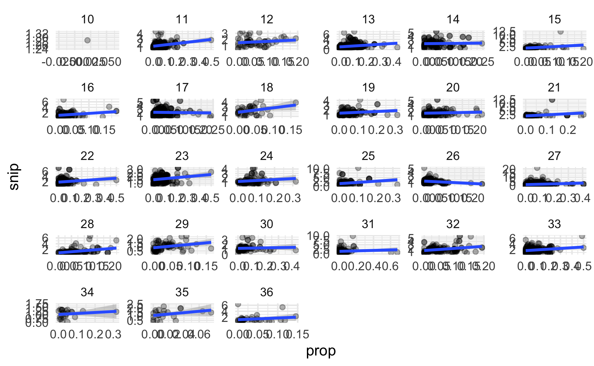
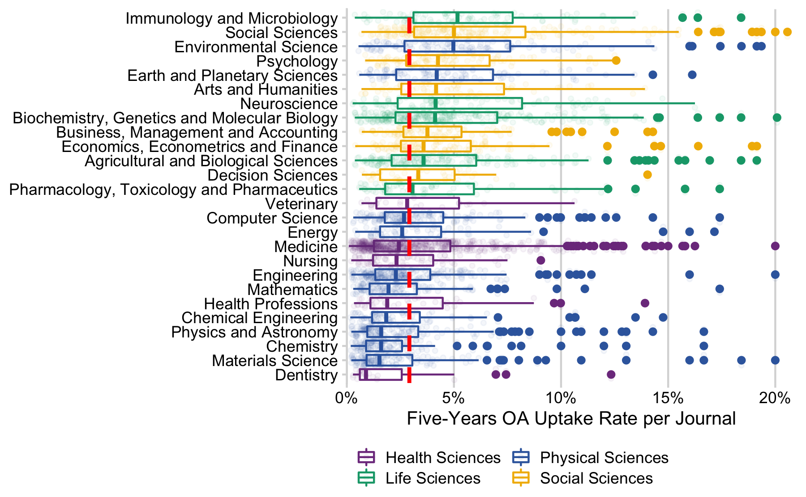

``` r
# libraries
library(tidyverse)
library(here)
library(cowplot)
library(gt)
library(janitor)
```

``` r
hybrid_volume <- readr::read_csv(here::here("data", "hybrid_volume_eligible.csv"))
```

``` r
ind_per_jn <- hybrid_volume %>%
  group_by(issn, container_title, articles, issued_year) %>%
  summarise(n = n_distinct(doi)) %>%
  mutate(prop = n / articles)
```

read in scopus journal indicators

``` r
scopus_19 <- readxl::read_excel(here::here("data", "scopus_jn.xlsx"), sheet = 2,
                                .name_repair = make_clean_names)
```

normalize scopus jn indicators

``` r
scopus_norm <- scopus_19 %>%
  gather(print_issn, e_issn, key = "issn_tpye", value = "issn") %>%
  # trailing zero's missing in Excel spreadsheet
  mutate(
    issn = ifelse(nchar(issn) == 5, paste0("000", issn), issn),
    issn = ifelse(nchar(issn) == 6, paste0("00", issn), issn),
    issn = ifelse(nchar(issn) == 7, paste0("0", issn), issn)) %>%
  # missing hyphen
  mutate(issn = map_chr(issn, function(x) paste(c(substr(x, 1, 4), substr(x, 5, 8)), collapse = "-")))
```

missing journals (needs to be validated)

``` r
hybrid_volume %>% 
  filter(!issn %in% scopus_norm$issn) %>% 
  distinct(issn, container_title)
#> # A tibble: 22 x 2
#>    issn      container_title                                       
#>    <chr>     <chr>                                                 
#>  1 0045-7825 Computer Methods in Applied Mechanics and Engineering 
#>  2 0094-114X Mechanism and Machine Theory                          
#>  3 0304-4165 Biochimica et Biophysica Acta (BBA) - General Subjects
#>  4 0301-7516 International Journal of Mineral Processing           
#>  5 0300-9440 Progress in Organic Coatings                          
#>  6 1878-786X Journal de Chirurgie Viscérale                        
#>  7 1359-5113 Process Biochemistry                                  
#>  8 2387-0206 Medicina Clínica (English Edition)                    
#>  9 0020-7063 The International Journal of Accounting               
#> 10 0968-0004 Trends in Biochemical Sciences                        
#> # … with 12 more rows
```

backup

``` r
cite_score_19 <- scopus_norm %>% 
  select(issn, contains("subject"), percentile, snip, sjr)
write_csv(cite_score_19, here::here("data", "cite_score_19.csv"))
```

``` r
ajsc_mapped <- read_csv(here::here("data", "asjc_mapped.csv")) %>%
  mutate(top_level_code = as.character(top_level_code))
hybrid_subject <- left_join(ind_per_jn, cite_score_19, by = c("issn" = "issn")) %>%
  mutate(top_level_code = substr(as.character(scopus_asjc_code_sub_subject_area), 1, 2)) %>%
  inner_join(ajsc_mapped, by = "top_level_code")
# backup subject liste
hybrid_subject %>% 
  ungroup() %>% 
  distinct(issn, container_title, subject_area, top_level = description) %>%
  write_csv(here::here("data", "jn_subjects.csv"))
```

### Correlation test

``` r
hybrid_subject_19 <- hybrid_subject %>% 
  filter(issued_year == "2019", !is.na(percentile)
         #, prop > 0.01 & prop < 0.15) 
         )%>%
  distinct(issn, prop, percentile, snip, sjr)
```

spearman

``` r
cor.test(hybrid_subject_19$prop, hybrid_subject_19$percentile, method = "spearman")
#> 
#>  Spearman's rank correlation rho
#> 
#> data:  hybrid_subject_19$prop and hybrid_subject_19$percentile
#> S = 7583619905, p-value <0.0000000000000002
#> alternative hypothesis: true rho is not equal to 0
#> sample estimates:
#>    rho 
#> 0.1734
```

plot

``` r
ggplot(hybrid_subject_19, aes(prop, percentile)) + geom_point(alpha = .3) + geom_smooth(method = "lm") +
  coord_cartesian(xlim = c(0.01, 0.5), ylim = c(0,100))
```



  - cell system, global food security

<!-- end list -->

``` r
hybrid_subject %>%
  filter(issued_year == "2019", !is.na(percentile)) %>% 
  ggplot(aes(prop, percentile)) + geom_point(alpha = .3) + geom_smooth(method = "lm") +
  facet_wrap(~top_level_code) +
  coord_cartesian(xlim = c(0.01, 0.5), ylim = c(0,100))
```


## OA proportion per subject

``` r
# sort by median per asjc subject group
subject_all_years <- hybrid_subject %>% 
  ungroup() %>% 
  group_by(issn, description, subject_area) %>% 
  summarise(n_oa = sum(n),
            n = sum(articles)) %>%
  ungroup() %>%
  group_by(description) %>%
  filter(subject_area != "Multidisciplinary")

ggplot(subject_all_years, aes(fct_reorder(description, n / n_oa, .fun = median, .desc = TRUE), n_oa / n)) + 
  geom_boxplot(aes(color = subject_area)) +
  geom_jitter(alpha = .05, aes(color = subject_area)) +
  coord_flip() +
  scale_colour_manual(values = c("#7F3C8D", "#11A579", "#3969AC", "#F2B701")) +
  scale_y_continuous(
    labels = scales::percent_format(accuracy = 5L),
    expand = expansion(mult = c(0, 0.05))
  ) +
  labs(x = NULL, y = "Five-Years OA Uptake Rate per Journal") +
  theme_minimal() +
  theme(legend.position = "top")
```



  - Comptes Rendus
    <https://www.library.illinois.edu/mtx/2020/05/01/comptes-rendus-de-lacademie-des-sciences-important-publishing-and-access-changes/>

### by funder

``` r
jn_subjects <- read_csv(here::here("data", "jn_subjects.csv"))

hybrid_volume_subjects <- hybrid_volume %>%
  group_by(oa_sponsor_type, articles, issued_year, issn) %>% 
  summarise(n_oa = n_distinct(doi)) %>% 
  left_join(jn_subjects, by = "issn") %>%
  ungroup()

hybrid_volume_subjects %>%
 # filter(container_title == "Journal of the American College of Cardiology") %>%
  group_by(top_level, articles, issued_year) %>%
  summarise(n_oa = sum(n_oa)) %>%
  ungroup() %>%
  group_by(top_level) %>%
  summarise(n_oa = sum(n_oa),
            n = sum(articles), .groups = "drop") %>%
  mutate(prop = n_oa / n) %>%
  arrange(desc(prop))
#> # A tibble: 28 x 4
#>    top_level                                     n_oa      n   prop
#>    <chr>                                        <int>  <dbl>  <dbl>
#>  1 Veterinary                                    2091  25292 0.0827
#>  2 Social Sciences                               6317  80535 0.0784
#>  3 Arts and Humanities                           1565  23795 0.0658
#>  4 Immunology and Microbiology                   5530  87145 0.0635
#>  5 Earth and Planetary Sciences                  4545  94792 0.0479
#>  6 Psychology                                    3052  64691 0.0472
#>  7 Agricultural and Biological Sciences          8044 175069 0.0459
#>  8 Biochemistry, Genetics and Molecular Biology 15881 349356 0.0455
#>  9 Economics, Econometrics and Finance           2071  46940 0.0441
#> 10 Neuroscience                                  5846 132617 0.0441
#> # … with 18 more rows
  

# hybrid_volume %>%
#   left_join(jn_subjects, by = "issn") %>%
#   group_by(oa_sponsor_type, issn, issued_year, top_level, articles) %>%
#   summarise(n_oa = n_distinct(doi)) %>%
#   group_by(oa_sponsor_type, issued_year, top_level) %>%
#   summarise(n_oa = sum(n_oa),
#             n = sum(articles)) %>%
#   ungroup() %>%
#   group_by(top_level, oa_sponsor_type) %>%
#   summarise(n_oa = sum(n_oa, na.rm = TRUE),
#             n = sum(n, na.rm = TRUE)) %>%
#   mutate(prop = n_oa / n) %>% View()
# 
# 
# hybrid_volume %>%
#   left_join(jn_subjects, by = "issn") %>%
#   group_by(issn, issued_year, top_level, article) %>%
#   summarise(n_oa = n_distinct(doi)) %>%
#   group_by(issued_year, top_level) %>%
#   summarise(nn = sum(n_oa))
```
