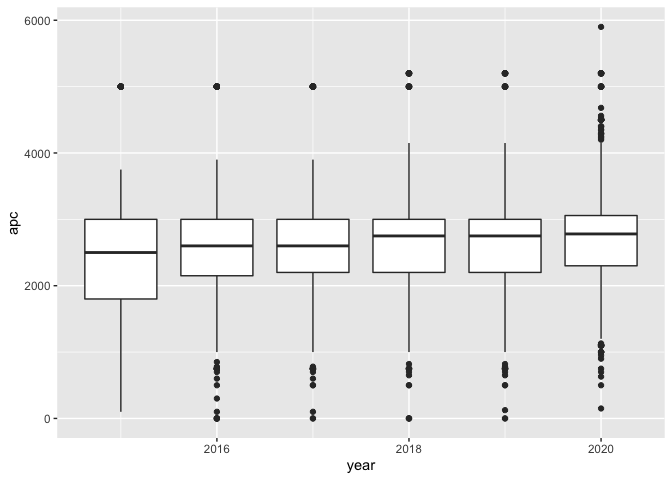
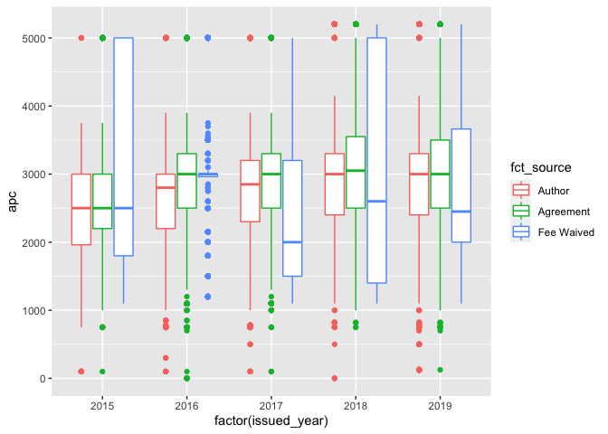
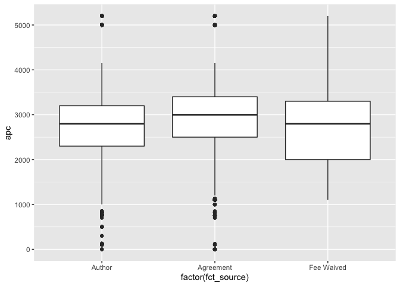

pricing differences
================

read invoicing data

``` r
hybrid_df <- readr::read_csv(here::here("data", "hybrid_articles.csv"))
```

    ## Parsed with column specification:
    ## cols(
    ##   .default = col_character(),
    ##   oa_article = col_logical(),
    ##   oa_archive = col_logical(),
    ##   issued = col_date(format = ""),
    ##   issued_year = col_double(),
    ##   created = col_date(format = ""),
    ##   published_print = col_date(format = ""),
    ##   published_online = col_logical(),
    ##   member = col_double(),
    ##   reference_count = col_double(),
    ##   is_referenced_by_count = col_double(),
    ##   indexed = col_date(format = ""),
    ##   date = col_date(format = ""),
    ##   delay_in_days = col_double()
    ## )

    ## See spec(...) for full column specifications.

apc price list

``` r
els_jn <- readr::read_csv(here::here("data", "els_historic_jns.csv"))
```

    ## Parsed with column specification:
    ## cols(
    ##   issn = col_character(),
    ##   journal_title = col_character(),
    ##   oa_model = col_character(),
    ##   apc = col_double(),
    ##   year = col_double()
    ## )

APC development hybrid oa portflio

``` r
els_jn %>%
  filter(oa_model == "Hybrid") %>%
  ggplot(aes(year, apc, group = year)) +
  geom_boxplot()
```

    ## Warning: Removed 2 rows containing non-finite values (stat_boxplot).

<!-- -->

By invoicing

``` r
my_df <- left_join(hybrid_df, els_jn, by = c("issn", "issued_year" = "year")) %>%
    mutate(oa_sponsor_type = recode(oa_sponsor_type, 
                                  `FundingBody` = "Agreement",
                                  `ElsevierWaived` = "Fee Waived")) %>%
  mutate(fct_source = fct_infreq(oa_sponsor_type)) %>%
  mutate(fct_source = fct_lump(fct_source, prop = 0.05)) %>%
  filter(!fct_source %in% c("Other", NA))
```

``` r
ggplot(my_df, aes(factor(issued_year), apc,  color = fct_source)) +
  geom_boxplot()
```

    ## Warning: Removed 1507 rows containing non-finite values (stat_boxplot).

<!-- -->

All

``` r
ggplot(my_df, aes(factor(fct_source), apc)) +
  geom_boxplot()
```

    ## Warning: Removed 1507 rows containing non-finite values (stat_boxplot).

<!-- -->
