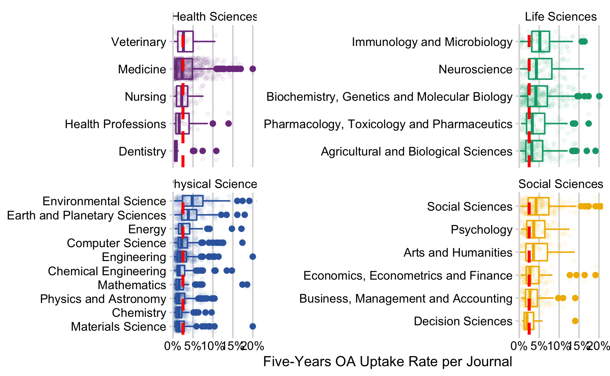

results
================
Najko Jahn
7/7/2020

## Results

### Uptake

#### How many Elsevier journals supported the hybrid model? How many of them flipped to fully open access?

Using text-mined data from web-archived Elsevier APC pricing lists
(Matthias 2020), we were able to determine the evolution of Elsevier’s
open access journal portfolio including hybrid journals. Figure shows
that the majority of journals supported the hybrid model. The year 2016
marked the highest number of journals. After that, the trend reversed.
Since 2018, the number of journals stagnated.

Compared to 2015, the number of hybrid journals grew by 255 journals,
while its proportion relative to Elsevier’s overall journal portfolio
slightly decreased from 86% to 85%.

Following the approach of an earlier study (Matthias, Jahn, and Laakso
2019), we furthermore used APC pricing list information to determine the
number of open access business model flips between 2015-2020. Although
the transition from hybrid to a fully open access business model has
drawn most attention, also the reverse can be observed. A total number
of 50 journals changed the business model under the ownership of
Elsevier. Of these, 38 journals flipped to fully open access, while
12changed to hybrid open access. Examples include the physical journal
*Materials Today* and the life science journal *Meta Gene*.

#### What is the uptake of open access in Elsevier’s current hybrid journal portfolio?

*Number and percentage of journals with at least one article*

<!-- here, we change to the most current pricing list, which seems to be identical to 31 May-->

To determine the number of Elsevier hybrid journals with at least one
open access article, we downloaded and parsed the publisher’s APC
pricing list from 31 May 2020. The list comprised 2,339 journals, of
which 1,982 supported the hybrid model, representing a share of 85%. Of
those, 1,765 hybrid journals published at least one open access article
immediately under a Creative Commons license between 2015 and 2019,
corresponding to about 89% of journal titles in Elsevier’s hybrid
journal portfolio. At the same time, 11% of hybrid journals did not
published an open access article.

*Number and percentage of open access articles per hybrid journal*

We used the Crossref index to determine the overall article volume of
Elsevier’s hybrid journal portfolio, and to related it to the number of
open access articles. Because DOIs can be also issued to abstracts
presented at scientific meetings and non-scholarly journal content
including table of contents and list of reviewers, we furthermore
distinguished between citing and non-citing articles defined by the
number of deposited references in Crossref per article, regardless of
whether they are public or not.

Table presents the high-level findings by year of publication.
illustrating a growth

Matthias, Lisa. 2020. “Publisher Oa Portfolios 2.0.” Zenodo.
<https://doi.org/10.5281/zenodo.3841568>.

Matthias, Lisa, Najko Jahn, and Mikael Laakso. 2019. “The Two-Way Street
of Open Access Journal Publishing: Flip It and Reverse It.”
*Publications* 7 (2): 23. <https://doi.org/10.3390/publications7020023>.

