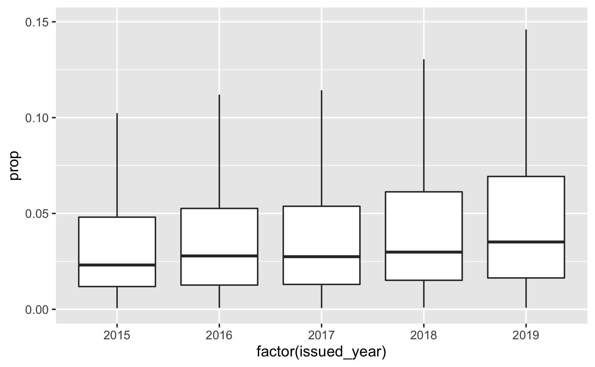

## Results

### Uptake

#### How many Elsevier journals supported the hybrid model?

Using text-mined data from web-archived Elsevier APC pricing lists
(Matthias 2020), we were able to determine the evolution of Elsevier’s
open access journal portfolio. Figure shows that the majority of
journals were hybrid journals. Overall, Elsevier published 2,955 open
access journals, of which 2,238 supported the hybrid model.

Elsevier’s journal portfolio changed over the period of observation. The
number of hybrid journals grew by 255 journals between 2015 and May
2020, while its proportion relative to Elsevier’s overall journal
portfolio slightly decreased from 86% to 85%. The year 2016 marked the
highest number of journals. After that, the trend reversed. Since 2018,
the number of journals stagnated. On 23 May 2020, Elsevier APC pricing
list comprised 2,339 journals, of which 1,982 supported the hybrid
model, representing a share of 85%.

#### How many of hybrid journals flipped to fully open access?

Following the approach of our earlier study (Matthias, Jahn, and Laakso
2019), we started with APC pricing list information to determine the
number of open access business model flips between 2015-2020. Although
the transition from hybrid to a fully open access business model has
drawn most attention, also the reverse can be observed. A total number
of 50 journals changed the business model under the ownership of
Elsevier. Of these, 38 journals flipped to fully open access, while 12
changed to hybrid open access. Examples for such reverse flipped open
access journals include the physical journal *Materials Today* and the
life science journal *Meta Gene*.

#### What is the uptake of open access in Elsevier’s current hybrid journal portfolio?

*Number and percentage of journals with at least one article*

To determine the number of Elsevier hybrid journals with at least one
open access article, we focused on the most current version of
Elsevier’s APC pricing list, lastly updated on 23 May 2020 (Matthias
2020). We used the Crossref index to determine the overall article
volume of Elsevier’s hybrid journal portfolio, and related it to the
number of open access articles indicated by Creative Commons licenses.
We only considered open access articles that were provided without
delay, which we determined from mined full-text metadata. Because
Elsevier also issued DOIs to non-scholarly journal content including
table of contents and list of reviewers, we excluded these records using
Unpaywall’s paratext recognition approach.\[1\] They account for about
2.5% of DOIs registered by Crossref.

On 23 May 2020, Elsevier APC pricing list comprised 1,982 journals that
supported the hybrid model. Of those, 1,765 hybrid journals published at
least one open access article under a Creative Commons license between
2015 and 2019, corresponding to about 89% of journal titles in
Elsevier’s hybrid journal portfolio. At the same time, 11% of hybrid
journals did not published an open access article.

*Number and percentage of immediate open access articles per hybrid
journal*

Overall, 1,765 hybrid journals provided immediate open access to 85,185
articles between 2015 and 2019. The total share of hybrid open access in
the publication volume of Elsevier journals was 3.2%. Table present the
high-level findings by year, illustrating a moderate growth in hybrid
open access. Although the number of hybrid journals with at least one
open access article remained somehow constant, the number of open access
articles rose substantially from 13,308 (2015) to 21,873 (2019).
However, the overall uptake of open access in Elsevier’s hybrid journal
portfolio grew slowly from 2.8% (2015) to 3.7% (2019), because the
number of articles published also increased during this five-years
period.

<!--html_preserve-->

<table class="gt_table">

<thead class="gt_col_headings">

<tr>

<th class="gt_col_heading gt_columns_bottom_border gt_left" rowspan="1" colspan="1">

</th>

<th class="gt_col_heading gt_columns_bottom_border gt_right" rowspan="1" colspan="1">

2015

</th>

<th class="gt_col_heading gt_columns_bottom_border gt_right" rowspan="1" colspan="1">

2016

</th>

<th class="gt_col_heading gt_columns_bottom_border gt_right" rowspan="1" colspan="1">

2017

</th>

<th class="gt_col_heading gt_columns_bottom_border gt_right" rowspan="1" colspan="1">

2018

</th>

<th class="gt_col_heading gt_columns_bottom_border gt_right" rowspan="1" colspan="1">

2019

</th>

<th class="gt_col_heading gt_columns_bottom_border gt_right" rowspan="1" colspan="1">

2015-19

</th>

</tr>

</thead>

<tbody class="gt_table_body">

<tr class="gt_group_heading_row">

<td colspan="7" class="gt_group_heading" style="font-weight: bold;">

Publication Volume

</td>

</tr>

<tr>

<td class="gt_row gt_left gt_stub">

Articles

</td>

<td class="gt_row gt_right">

483,340

</td>

<td class="gt_row gt_right">

509,038

</td>

<td class="gt_row gt_right">

523,442

</td>

<td class="gt_row gt_right">

549,062

</td>

<td class="gt_row gt_right">

583,825

</td>

<td class="gt_row gt_right">

2,648,707

</td>

</tr>

<tr>

<td class="gt_row gt_left gt_stub">

Mean

</td>

<td class="gt_row gt_right">

279.23

</td>

<td class="gt_row gt_right">

291.38

</td>

<td class="gt_row gt_right">

297.58

</td>

<td class="gt_row gt_right">

312.32

</td>

<td class="gt_row gt_right">

331.72

</td>

<td class="gt_row gt_right">

1,500.68

</td>

</tr>

<tr>

<td class="gt_row gt_left gt_stub">

SD

</td>

<td class="gt_row gt_right">

407.65

</td>

<td class="gt_row gt_right">

432.13

</td>

<td class="gt_row gt_right">

449.96

</td>

<td class="gt_row gt_right">

480.36

</td>

<td class="gt_row gt_right">

522.18

</td>

<td class="gt_row gt_right">

2,200.69

</td>

</tr>

<tr class="gt_group_heading_row">

<td colspan="7" class="gt_group_heading" style="font-weight: bold;">

OA Volume

</td>

</tr>

<tr>

<td class="gt_row gt_left gt_stub">

Total

</td>

<td class="gt_row gt_right">

13,308

</td>

<td class="gt_row gt_right">

16,316

</td>

<td class="gt_row gt_right">

15,504

</td>

<td class="gt_row gt_right">

18,184

</td>

<td class="gt_row gt_right">

21,873

</td>

<td class="gt_row gt_right">

85,185

</td>

</tr>

<tr>

<td class="gt_row gt_left gt_stub">

Mean

</td>

<td class="gt_row gt_right">

10.10

</td>

<td class="gt_row gt_right">

11.89

</td>

<td class="gt_row gt_right">

11.00

</td>

<td class="gt_row gt_right">

12.07

</td>

<td class="gt_row gt_right">

13.60

</td>

<td class="gt_row gt_right">

48.26

</td>

</tr>

<tr>

<td class="gt_row gt_left gt_stub">

SD

</td>

<td class="gt_row gt_right">

52.27

</td>

<td class="gt_row gt_right">

75.50

</td>

<td class="gt_row gt_right">

52.47

</td>

<td class="gt_row gt_right">

64.53

</td>

<td class="gt_row gt_right">

69.52

</td>

<td class="gt_row gt_right">

280.37

</td>

</tr>

<tr class="gt_group_heading_row">

<td colspan="7" class="gt_group_heading" style="font-weight: bold;">

OA Uptake

</td>

</tr>

<tr>

<td class="gt_row gt_left gt_stub">

Overall OA Uptake

</td>

<td class="gt_row gt_right">

2.75

</td>

<td class="gt_row gt_right">

3.21

</td>

<td class="gt_row gt_right">

2.96

</td>

<td class="gt_row gt_right">

3.31

</td>

<td class="gt_row gt_right">

3.75

</td>

<td class="gt_row gt_right">

3.22

</td>

</tr>

<tr>

<td class="gt_row gt_left gt_stub">

Mean

</td>

<td class="gt_row gt_right">

3.78

</td>

<td class="gt_row gt_right">

4.46

</td>

<td class="gt_row gt_right">

4.35

</td>

<td class="gt_row gt_right">

4.68

</td>

<td class="gt_row gt_right">

5.24

</td>

<td class="gt_row gt_right">

4.33

</td>

</tr>

<tr>

<td class="gt_row gt_left gt_stub">

SD

</td>

<td class="gt_row gt_right">

5.15

</td>

<td class="gt_row gt_right">

7.08

</td>

<td class="gt_row gt_right">

5.52

</td>

<td class="gt_row gt_right">

5.38

</td>

<td class="gt_row gt_right">

5.95

</td>

<td class="gt_row gt_right">

5.01

</td>

</tr>

</tbody>

</table>

<!--/html_preserve-->

*variation*

We observed considerable variations across Elsevier hybrid journals
relative to the share of open access articles published by year. Figure
shows, in a diminutive chart, the range of open access uptake across
Elsevier hybrid journals between 2015 and 2019. The dot represents the
median by year, while the left and the right bars represents to 10th or
the 90th percentile; the distance between them represent the
distribution of open access rates of 80% of Elsevier journals, excluding
extreme outliers at the top or bottom respectively from the visual
presentation. Notably, uptake among above-average performing journals in
terms of published open access articles increased over the years.
Nevertheless, the proportion of open access articles published by
journals that operate above average can still be described as low; in
2019, 90% of Elsevier hybrid journals had an open access uptake of 11%
or less.

Open access uptake in Elsevier hybrid journals per year in percent,
visualised as diminutive distribution chart removing outliers at the top
or bottom respectively. Since 2015, most hybrid journals have had a slow
uptake rate of open access articles. In general, open access via the
hybrid open access publishing model played a marginal role in the
context of Elsevier’s total publication volume. However, many journals
operating above average in terms of published open access articles were
able to increase uptake rates over the years.

alternative box plot presentation

Matthias, Lisa. 2020. “Publisher Oa Portfolios 2.0.” Zenodo.
<https://doi.org/10.5281/zenodo.3841568>.

Matthias, Lisa, Najko Jahn, and Mikael Laakso. 2019. “The Two-Way Street
of Open Access Journal Publishing: Flip It and Reverse It.”
*Publications* 7 (2): 23. <https://doi.org/10.3390/publications7020023>.

1.  <https://support.unpaywall.org/support/solutions/articles/44001894783-what-does-is-paratext-mean-in-the-api->
