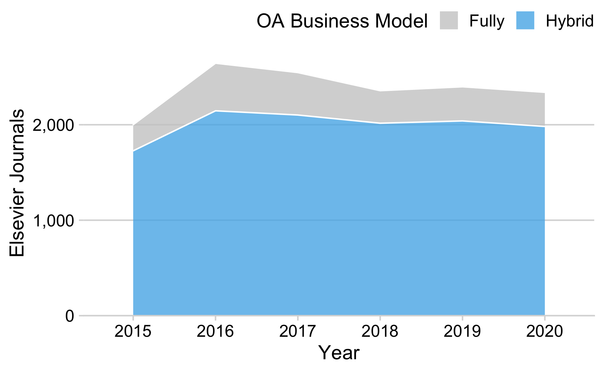

results
================
Najko Jahn
7/7/2020

## Results

### Uptake

#### How many Elsevier journals supported the hybrid model?

Using text-mined data from web-archived Elsevier APC pricing lists
(Matthias 2020), we were able to determine the evolution of Elsevier’s
open access journal portfolio including hybrid journals. Figure shows
that the majority of journals supported the hybrid model. Overall,
Elsevier published 2,955, of which 2,238 supported the hybrid model.

Elseviers journal portfolio changed over the period of observation. The
number of hybrid journals grew by 255 journals between 2015 and May
2020, while its proportion relative to Elsevier’s overall journal
portfolio slightly decreased from 86% to 85%. The year 2016 marked the
highest number of journals. After that, the trend reversed. Since 2018,
the number of journals stagnated. On 23 May 2020, Elsevier APC pricing
list comprised 2,339 journals, of which 1,982 supported the hybrid
model, representing a share of 85%.

#### How many of hybrid journals flipped to fully open access?

Following the approach of our earlier study (Matthias, Jahn, and Laakso
2019), we furthermore used APC pricing list information to determine the
number of open access business model flips between 2015-2020. Although
the transition from hybrid to a fully open access business model has
drawn most attention, also the reverse can be observed. A total number
of 50 journals changed the business model under the ownership of
Elsevier. Of these, 38 journals flipped to fully open access, while 12
changed to hybrid open access. Examples for such reverse flipped open
access journals include the physical journal *Materials Today* and the
life science journal *Meta Gene*.

#### What is the uptake of open access in Elsevier’s current hybrid journal portfolio?

*Number and percentage of journals with at least one article*

To determine the number of Elsevier hybrid journals with at least one
open access article, we focused on the most current version of
Elsevier’s APC pricing list, lastly updated on 23 May 2020 (Matthias
2020). We used the Crossref index to determine the overall article
volume of Elsevier’s hybrid journal portfolio, and related it to the
number of open access articles indicated by Creative Commons licenses.
We only considered open access articles that were provided without
delay, which we determined from mined full-text metadata. Because
Elsevier also issued DOIs to non-scholarly journal content including
table of contents and list of reviewers, we excluded these records using
Unpaywall’s paratext recognition approach.\[1\] They account for about
2.5% of DOIs registered by Crossref.

On 23 May 2020, Elsevier APC pricing list comprised 1,982 journals that
supported the hybrid model. Of those, 1,765 hybrid journals published at
least one open access article under a Creative Commons license between
2015 and 2019, corresponding to about 89% of journal titles in
Elsevier’s hybrid journal portfolio. At the same time, 11% of hybrid
journals did not published an open access article.

*Number and percentage of immediate open access articles per hybrid
journal*

|                                              |     2015 |     2016 |   2017 |     2018 |     2019 |     Total |
| -------------------------------------------- | -------: | -------: | -----: | -------: | -------: | --------: |
| Hybrid journals with at least one OA article |   1731.0 |   1747.0 |   1759 |   1758.0 |   1760.0 |    1765.0 |
| All Articles                                 | 483340.0 | 509038.0 | 523442 | 549062.0 | 583825.0 | 2648707.0 |
| Hybrid OA Articles                           |  13732.0 |  16592.0 |  15510 |  18191.0 |  21886.0 |   85911.0 |
| Percentage                                   |      2.8 |      3.3 |      3 |      3.3 |      3.7 |       3.2 |

Table presents the high-level findings by year of publication.
illustrating a growth

Matthias, Lisa. 2020. “Publisher Oa Portfolios 2.0.” Zenodo.
<https://doi.org/10.5281/zenodo.3841568>.

Matthias, Lisa, Najko Jahn, and Mikael Laakso. 2019. “The Two-Way Street
of Open Access Journal Publishing: Flip It and Reverse It.”
*Publications* 7 (2): 23. <https://doi.org/10.3390/publications7020023>.

1.  <https://support.unpaywall.org/support/solutions/articles/44001894783-what-does-is-paratext-mean-in-the-api->
