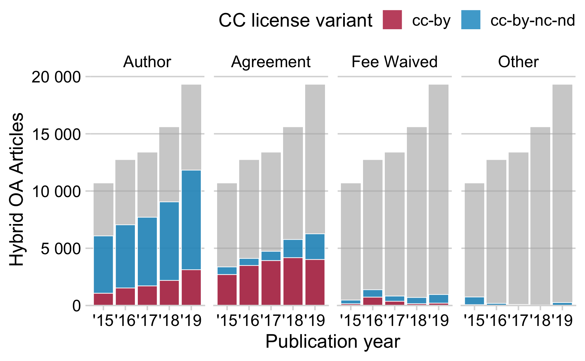
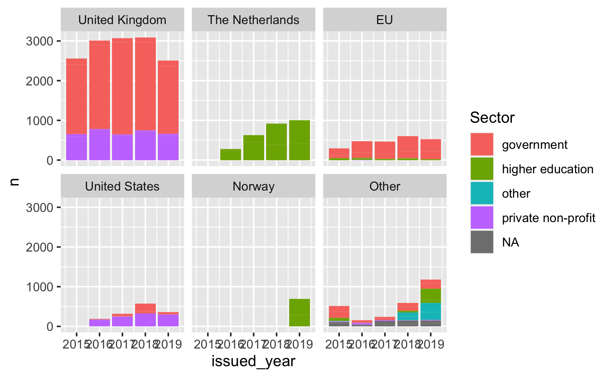
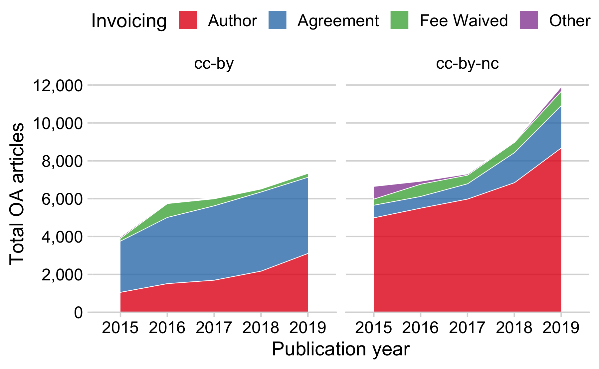
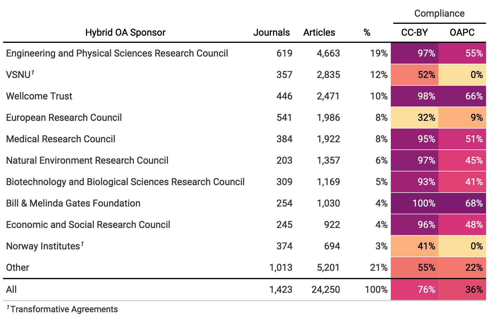
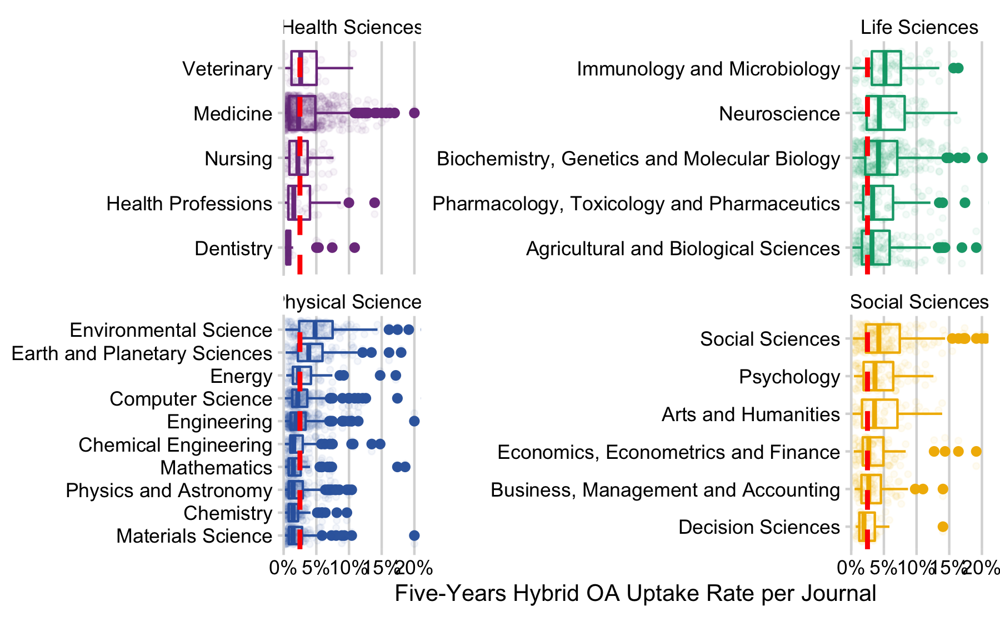

### Uptake

#### Elseviers open access journal portfolio

*How many Elsevier journals supported the hybrid model?*

Drawing on web-archived Elsevier APC pricing lists (Matthias 2020), we
determined the evolution of Elsevier’s open access journal portfolio.
Figure shows that the majority of journals were hybrid journals:
Elsevier published a total of 2,955 open access journals, of which 2,238
supported the hybrid model. Elsevier’s journal portfolio hardly changed.
The number of hybrid journals grew by 255 journals between 2015 and May
2020, while its proportion relative to Elsevier’s overall journal
portfolio slightly decreased from 86% to 85%. The year 2016 marked the
highest number of journals. After that, the trend reversed. Since 2018,
the number of journals stagnated. On 23 May 2020, Elsevier APC pricing
list comprised 2,339 journals, of which 1,982 supported the hybrid
model, representing a share of 85%.

Longitudinal development of Elsevier’s journal portfolio by open access
business model. The figure distinguishes between fully open access
journals that provide immediate open access to all articles and the
hybrid model. Data obtained from Elsevier APC pricing lists (Matthias
2020).

*How many of hybrid journals flipped to fully open access?*

Following the approach of our earlier study (Matthias, Jahn, and Laakso
2019), we draw on historic APC pricing lists to determine the number of
open access business model flips since 2015. Although the transition
from hybrid to a fully open access business model has drawn most
attention, also the reverse can be observed. A total number of 50
journals changed the business model under the ownership of Elsevier. Of
these, 38 journals flipped to fully open access, while 12 changed to
hybrid open access. Examples for such reverse flipped open access
journals include the physical journal *Materials Today* and the life
science journal *Meta Gene*.

#### Open Access Uptake

*What is the uptake of open access in Elsevier’s current hybrid journal
portfolio?*

To determine the number of Elsevier hybrid journals with at least one
open access article, we focused on the most current version of
Elsevier’s APC pricing list, lastly updated on 23 May 2020 (Matthias
2020). We used the Crossref index to determine the overall article
volume of Elsevier’s hybrid journal portfolio, and related it to the
number of open access articles indicated by Creative Commons licenses.
We only considered open access articles that were provided without
delay, which we determined from mined full-text metadata. Because
Elsevier also issued DOIs to non-scholarly journal content including
table of contents and list of reviewers, we excluded these records using
Unpaywall’s paratext recognition approach.\[1\] They account for about
2.5% of DOIs registered by Crossref. Moreover, we focused on articles
published in regular issues.

On 23 May 2020, Elsevier APC pricing list comprised 1,982 journals that
supported the hybrid model, without reverse-flips: 1,970. Of those,
1,755 hybrid journals published at least one open access article under a
Creative Commons license between 2015 and 2019, corresponding to about
89% of journal titles in Elsevier’s hybrid journal portfolio. These
journals published a total of 71,643 immediate open access articles
between 2015 and 2019, corresponding to a share of 3%. Table present the
high-level findings by year, illustrating a moderate growth in hybrid
open access. Although the number of hybrid journals with at least one
open access article remained somehow constant, the number of open access
articles rose substantially from 10,672 in 2015 to 19,311 in 2019.
However, the overall uptake of open access in Elsevier’s hybrid journal
portfolio grew slowly from 2.6% to 3.7%, because the number of articles
published also increased during this five-years period.

<!--html_preserve-->

<table class="gt_table" style="table-layout: fixed;; width: 0px">

<colgroup>

<col style="width:125px;"/>

<col style="width:80px;"/>

<col style="width:80px;"/>

<col style="width:80px;"/>

<col style="width:80px;"/>

<col style="width:80px;"/>

<col style="width:110px;"/>

</colgroup>

<thead class="gt_col_headings">

<tr>

<th class="gt_col_heading gt_columns_bottom_border gt_left" rowspan="1" colspan="1">

</th>

<th class="gt_col_heading gt_columns_bottom_border gt_right" rowspan="1" colspan="1" style="color: black; font-weight: bold;">

2015

</th>

<th class="gt_col_heading gt_columns_bottom_border gt_right" rowspan="1" colspan="1" style="color: black; font-weight: bold;">

2016

</th>

<th class="gt_col_heading gt_columns_bottom_border gt_right" rowspan="1" colspan="1" style="color: black; font-weight: bold;">

2017

</th>

<th class="gt_col_heading gt_columns_bottom_border gt_right" rowspan="1" colspan="1" style="color: black; font-weight: bold;">

2018

</th>

<th class="gt_col_heading gt_columns_bottom_border gt_right" rowspan="1" colspan="1" style="color: black; font-weight: bold;">

2019

</th>

<th class="gt_col_heading gt_columns_bottom_border gt_right" rowspan="1" colspan="1" style="background-color: #E5E5E5; color: black; font-weight: bold;">

2015-19

</th>

</tr>

</thead>

<tbody class="gt_table_body">

<tr class="gt_group_heading_row">

<td colspan="7" class="gt_group_heading" style="color: black; font-style: italic;">

Elsevier Hybrid Journals with ≥ 1 OA article

</td>

</tr>

<tr>

<td class="gt_row gt_left gt_stub" style="font-weight: bold;">

All (n)

</td>

<td class="gt_row gt_right">

1,317

</td>

<td class="gt_row gt_right">

1,364

</td>

<td class="gt_row gt_right">

1,401

</td>

<td class="gt_row gt_right">

1,501

</td>

<td class="gt_row gt_right">

1,600

</td>

<td class="gt_row gt_right" style="background-color: #E5E5E5;">

1,755

</td>

</tr>

<tr class="gt_group_heading_row">

<td colspan="7" class="gt_group_heading" style="color: black; font-style: italic;">

Articles in Elsevier Hybrid Journals with ≥ 1 OA article

</td>

</tr>

<tr>

<td class="gt_row gt_left gt_stub" style="font-weight: bold;">

All (n)

</td>

<td class="gt_row gt_right">

406,701

</td>

<td class="gt_row gt_right">

422,423

</td>

<td class="gt_row gt_right">

436,418

</td>

<td class="gt_row gt_right">

468,952

</td>

<td class="gt_row gt_right">

518,062

</td>

<td class="gt_row gt_right" style="background-color: #E5E5E5;">

2,422,087

</td>

</tr>

<tr>

<td class="gt_row gt_left gt_stub">

Avg.

</td>

<td class="gt_row gt_right">

308.8

</td>

<td class="gt_row gt_right">

309.7

</td>

<td class="gt_row gt_right">

311.5

</td>

<td class="gt_row gt_right">

312.4

</td>

<td class="gt_row gt_right">

323.8

</td>

<td class="gt_row gt_right" style="background-color: #E5E5E5;">

1,380.1

</td>

</tr>

<tr>

<td class="gt_row gt_left gt_stub">

SD

</td>

<td class="gt_row gt_right">

401.1

</td>

<td class="gt_row gt_right">

419.6

</td>

<td class="gt_row gt_right">

427.5

</td>

<td class="gt_row gt_right">

445.6

</td>

<td class="gt_row gt_right">

479.9

</td>

<td class="gt_row gt_right" style="background-color: #E5E5E5;">

1,937.5

</td>

</tr>

<tr>

<td class="gt_row gt_left gt_stub" style="font-weight: bold;">

OA (n)

</td>

<td class="gt_row gt_right">

10,672

</td>

<td class="gt_row gt_right">

12,729

</td>

<td class="gt_row gt_right">

13,361

</td>

<td class="gt_row gt_right">

15,570

</td>

<td class="gt_row gt_right">

19,311

</td>

<td class="gt_row gt_right" style="background-color: #E5E5E5;">

71,643

</td>

</tr>

<tr>

<td class="gt_row gt_left gt_stub">

Avg.

</td>

<td class="gt_row gt_right">

8.1

</td>

<td class="gt_row gt_right">

9.3

</td>

<td class="gt_row gt_right">

9.5

</td>

<td class="gt_row gt_right">

10.4

</td>

<td class="gt_row gt_right">

12.1

</td>

<td class="gt_row gt_right" style="background-color: #E5E5E5;">

40.8

</td>

</tr>

<tr>

<td class="gt_row gt_left gt_stub">

SD

</td>

<td class="gt_row gt_right">

12.9

</td>

<td class="gt_row gt_right">

19.7

</td>

<td class="gt_row gt_right">

15.6

</td>

<td class="gt_row gt_right">

16.2

</td>

<td class="gt_row gt_right">

20.1

</td>

<td class="gt_row gt_right" style="background-color: #E5E5E5;">

68.9

</td>

</tr>

<tr class="gt_group_heading_row">

<td colspan="7" class="gt_group_heading" style="color: black; font-style: italic;">

OA Uptake in Elsevier Hybrid Journals with ≥ 1 OA article

</td>

</tr>

<tr>

<td class="gt_row gt_left gt_stub" style="font-weight: bold;">

Total (%)

</td>

<td class="gt_row gt_right">

2.6

</td>

<td class="gt_row gt_right">

3.0

</td>

<td class="gt_row gt_right">

3.1

</td>

<td class="gt_row gt_right">

3.3

</td>

<td class="gt_row gt_right">

3.7

</td>

<td class="gt_row gt_right" style="background-color: #E5E5E5;">

3.0

</td>

</tr>

<tr>

<td class="gt_row gt_left gt_stub">

Avg.

</td>

<td class="gt_row gt_right">

3.7

</td>

<td class="gt_row gt_right">

4.3

</td>

<td class="gt_row gt_right">

4.4

</td>

<td class="gt_row gt_right">

4.7

</td>

<td class="gt_row gt_right">

5.4

</td>

<td class="gt_row gt_right" style="background-color: #E5E5E5;">

3.8

</td>

</tr>

<tr>

<td class="gt_row gt_left gt_stub">

SD

</td>

<td class="gt_row gt_right">

4.5

</td>

<td class="gt_row gt_right">

5.9

</td>

<td class="gt_row gt_right">

5.1

</td>

<td class="gt_row gt_right">

4.9

</td>

<td class="gt_row gt_right">

5.7

</td>

<td class="gt_row gt_right" style="background-color: #E5E5E5;">

4.1

</td>

</tr>

</tbody>

</table>

<!--/html_preserve-->

Figure presents to which extent the open access uptake rates varied
among Elsevier hybrid journals between 2015 and 2019. The
box-and-whiskers plot displays the distribution of the open access
percentage per journal broken down by year. It visualizes the median
open access proportion in the journal sample, the range of the majority
of journals, and individual outliers represented as dots. Notably, upper
quartiles and whiskers stretch farther over the years, indicating that
the range of uptake among journals with an above-average proportion of
open access articles increased over the years. Nevertheless, the
prevalence of open access even among these journals can be described as
relatively low; in 2019, 95% of Elsevier hybrid journals published 16%
or less open access articles.

Open access uptake per Elsevier hybrid journal in percent by year,
visualized as box-and-whiskers plot. The Y-axis is limited to an open
access share of 18%.

    #> # A tibble: 10 x 4
    #> # Groups:   issued_year [5]
    #>    cc_norm     issued_year cc_articles  prop
    #>    <chr>             <dbl>       <int> <dbl>
    #>  1 cc-by              2015        4004 0.375
    #>  2 cc-by              2016        5790 0.455
    #>  3 cc-by              2017        6037 0.452
    #>  4 cc-by              2018        6544 0.420
    #>  5 cc-by              2019        7377 0.382
    #>  6 cc-by-nc-nd        2015        6668 0.625
    #>  7 cc-by-nc-nd        2016        6939 0.545
    #>  8 cc-by-nc-nd        2017        7324 0.548
    #>  9 cc-by-nc-nd        2018        9026 0.580
    #> 10 cc-by-nc-nd        2019       11934 0.618

*Under which open content licenses are the open access articles
distributed?*

Figure presents a breakdown by Creative Commons license variant used for
hybrid open access by year. Elsevier provided commercial (cc-by) and a
less permissive non-commercial license (cc-by-nc) for open access
publishing in otherwise subscription-based journals. 58 percent of open
access articles can be re-used for non-commercial purposes (n = 41,891).
This proportion remained the same between 2015-19.

Immediate open access articles in hybrid journals by open content
license and year. The blue area represent articles permitting commercial
adaption under a Creative Commons CC-BY license, while the purple area
displays articles under a less permissive Commons CC-BY-ND-NC license.

*How does hybrid open access compare to full and delayed open access?*

    #> # A tibble: 3 x 3
    #>   type                           n  prop
    #>   <chr>                      <dbl> <dbl>
    #> 1 full_oa                    93315 0.284
    #> 2 hybrid_delayed_articles   163643 0.498
    #> 3 hybrid_immediate_articles  71643 0.218
    #> # A tibble: 7 x 4
    #> # Groups:   type [3]
    #>   type                      license_code      n    prop
    #>   <chr>                     <chr>         <dbl>   <dbl>
    #> 1 full_oa                   cc-by         17293 0.185  
    #> 2 full_oa                   cc-by-nc-nd   76022 0.815  
    #> 3 hybrid_delayed_articles   cc-by          1568 0.00958
    #> 4 hybrid_delayed_articles   cc-by-nc-nd    7529 0.0460 
    #> 5 hybrid_delayed_articles   els-user     154546 0.944  
    #> 6 hybrid_immediate_articles cc-by         29752 0.415  
    #> 7 hybrid_immediate_articles cc-by-nc-nd   41891 0.585
    #> [1] 328601

Next, we present a breakdown of open content licensed articles by open
access type relative to Elsevier’s journal productivity (ses Figure). In
total, Elsevier provided open access to 328,601 articles at he time of
our study, corresponding to an open access share of 12%. Hybrid open
access had the lowest proportion ( 22), while over half of open access
articles were made freely available after an embargo period ( 50%)
(Figure A). 28% of open access articles appeared in full open access
journals.

Of those,

Open Access in Elsevier journals in terms of article volume between
2015-2019, showing a breakdown by business type, distinguishing between
immediate open access provision in otherwise subscription-based journals
(“Hybrid OA”), articles in fully open access journals and delayed open
access under the Elsevier Open Archive program. Figure A presents a
breakdown by open content license. Y-Axis represents the proportion of
articles relative to the overall article output in percent. Figure B
presents the number of articles for each opena ccess types across the
five-years period 2015-19.

Figure B presents a breakdown of open content licensed articles by open
access type and year relative to the total publication volume published
in Elsevier journals between 2015-19. In addition to Creative Commons
licenses, Elsevier also published delayed open access under an Elsevier
user license (els-user), which prohibits re-use for commercial purposes.
The license is mainly used by journals participating in Elsevier’s open
archive program comprising around 140 journals, providing free access to
scholarly articles after an embargo period that range between 12 months
and 48 months. Figure reveals that about half of open access articles
were made available under the Elsevier user license. The minority of
open access articles can be re-used for commercial purposes ( 15% of
open access articles under an CC-BY license). Hybrid open access had the
highest proportion of openly available articles under a CC-BY licenses.

### Invoicing

| fct\_source |    nn | cumsum |  prop | cumprop |
| :---------- | ----: | -----: | ----: | ------: |
| Author      | 41725 |  41725 |  58.2 |    58.2 |
| Agreement   | 24250 |  65975 |  33.8 |    92.1 |
| Fee Waived  |  4345 |  70320 |   6.1 |    98.2 |
| Other       |  1323 |  71643 |   1.8 |   100.0 |
| Total       | 71643 | 249663 | 100.0 |   348.5 |

To examine the funding structure for open access articles, we text-mined
spending metadata from open access full-texts. Figure
(**???**)(fig:invoiceoverview)
shows the annual development per invoicing type. Each type is visualised
separately as parts of the total. The grey areas show the overall yearly
distribution of open access articles in hybrid journals, and the
proportion of each invoicing type is highlighted in blue. The figure
illustrates a general growth of open access articles in hybrid journals.
This development was mainly driven by billing authors individually
(“Author”), while central invoicing (“Agreement”) stagnated. Also, the
number of fee-waived articles (“Fee Waived”) somehow constant from 2015
to date. In most cases, Elsevier charged individual authors ( 58%.
Invoices addressed to funders and research organizations accounted for
34% of articles. The proportion of open access articles with publication
fee waivers was 6%.

Development of fee-based open access publishing in Elsevier hybrid
journals by invoicing type. Colored bars represent the invoice
recipient, or whether the fee was waived. Grey bars show the total
number of hybrid open access articles published in Elsevier journals
from 2015 to date.

| Country/Subject Area | Health Science | Life Sciences | Physical Sciences |  SSH | Broad |   NA | Total |
| :------------------- | -------------: | ------------: | ----------------: | ---: | ----: | ---: | ----: |
| United Kingdom       |           0.24 |           0.1 |              0.20 | 0.05 |    NA |   NA |  0.59 |
| The Netherlands      |             NA |            NA |                NA |   NA |  0.12 |   NA |  0.12 |
| EU                   |           0.00 |           0.0 |              0.01 |   NA |  0.08 |   NA |  0.09 |
| United States        |           0.05 |           0.0 |                NA |   NA |  0.01 |   NA |  0.06 |
| Norway               |             NA |            NA |                NA |   NA |  0.03 |   NA |  0.03 |
| Other                |           0.01 |           0.0 |              0.01 | 0.00 |  0.07 | 0.02 |  0.11 |
| Total                |           0.30 |           0.1 |              0.22 | 0.05 |  0.31 | 0.02 |  1.00 |

Figure presents a breakdown by country, highlighting the dominating role
of a few countries. Not surprisingly, mostly British funders paid for
hybrid open access in Elsevier hybrid journals ( 24 10 20 5%), followed
by funding bodies from the European Commission ( 800 1%) and the
Netherlands ( 12%). In the latter case, invoices for individual open
access articles were not send to research funders, but to the Dutch
VSNU, a consortium of Universities in the Netherlands that has
negotiated agreements with Elsevier since 2016. The prominent role of
Norway can be also explained by a national deal, which started in 2019.
US-based open access sponsors originated mainly from the Bill & Melinda
Gates Foundation (n = 1,030).

    #> # A tibble: 6 x 3
    #>   country_factor     nn   prop
    #>   <fct>           <int>  <dbl>
    #> 1 United Kingdom  14238 0.587 
    #> 2 The Netherlands  2835 0.117 
    #> 3 EU               2364 0.0975
    #> 4 United States    1433 0.0591
    #> 5 Norway            694 0.0286
    #> 6 Other            2686 0.111

### wavied

    #> # A tibble: 33 x 3
    #>    oa_sponsor_name                     n    prop
    #>    <chr>                           <int>   <dbl>
    #>  1 <NA>                             2099 0.483  
    #>  2 Third-Party Sponsor               888 0.204  
    #>  3 Académie des Sciences             853 0.196  
    #>  4 Journal Society Affiliation       128 0.0295 
    #>  5 National Institutes of Health      84 0.0193 
    #>  6 Bill & Melinda Gates Foundation    74 0.0170 
    #>  7 Wellcome Trust                     47 0.0108 
    #>  8 Medical Research Council           36 0.00829
    #>  9 European Research Council          25 0.00575
    #> 10 Department of Health UK            17 0.00391
    #> # … with 23 more rows

    #> # A tibble: 4 x 3
    #>   fct_source    nn   prop
    #>   <fct>      <int>  <dbl>
    #> 1 Author     41725 0.582 
    #> 2 Agreement  24250 0.338 
    #> 3 Fee Waived  4345 0.0606
    #> 4 Other       1323 0.0185

In terms of licensing, the type of invoicing is strongly related to
whether the open content license permits commercial adaption or not (see
figure). Although most open access articles published in Elsevier’s
hybrid journals were billed to authors directly, centrally invoiced
articles accounted for the largest share of articles under an CC BY
licenses.

    #> # A tibble: 2 x 3
    #>   cc_norm     nn  prop
    #>   <chr>    <int> <dbl>
    #> 1 cc-by    18331 0.756
    #> 2 cc-by-nc  5919 0.244

Invoicing for open access articles in hybrid journals by open content
license, 2015-2019.

Examining funders and research organisations that were invoiced directly
by Elsevier, strongly suggests that a few funders with a strict CC-BY
policy have contributed to the dominance of CC-BY license. Table
presents the Top 10 out of 69 sponsoring bodies in terms of funded open
access articles between 2015-19. Together, these funders accounted for
around 80% of central payments. The table furthermore shows the number
of distinct journals and the share of CC-BY licensed articles. Notably,
UK-based research funders and the Bill & Melinda Gates Foundation
sponsored mainly articles that were published under a CC-BY license. On
the contrary, articles funded by the Dutch VSNU, the European Research
Council and Norway Institutes had a much lower proportion. In fact, the
Dutch and Norwegian agreements allowed authors to decide whether to
publish under an CC-BY or CC-BY-ND license, while the UK-based funders
had a CC-BY licensing policy.

<!--html_preserve-->

<table class="gt_table" style="table-layout: fixed;">

<colgroup>

<col/>

<col style="width:80px;"/>

<col style="width:80px;"/>

<col style="width:80px;"/>

<col style="width:80px;"/>

<col style="width:80px;"/>

</colgroup>

<thead class="gt_col_headings">

<tr>

<th class="gt_col_heading gt_center gt_columns_bottom_border" rowspan="2" colspan="1" style="color: black; font-weight: bold;">

Hybrid OA Sponsor

</th>

<th class="gt_col_heading gt_center gt_columns_bottom_border" rowspan="2" colspan="1" style="color: black; font-weight: bold;">

Journals

</th>

<th class="gt_col_heading gt_center gt_columns_bottom_border" rowspan="2" colspan="1" style="color: black; font-weight: bold;">

Articles

</th>

<th class="gt_col_heading gt_center gt_columns_bottom_border" rowspan="2" colspan="1" style="color: black; font-weight: bold;">

%

</th>

<th class="gt_center gt_columns_top_border gt_column_spanner_outer" rowspan="1" colspan="2">

<strong>Compliance</strong>

</th>

</tr>

<tr>

<th class="gt_col_heading gt_columns_bottom_border gt_center" rowspan="1" colspan="1" style="color: black; font-weight: bold;">

CC-BY

</th>

<th class="gt_col_heading gt_columns_bottom_border gt_center" rowspan="1" colspan="1" style="color: black; font-weight: bold;">

OAPC

</th>

</tr>

</thead>

<tbody class="gt_table_body">

<tr>

<td class="gt_row gt_left">

Engineering and Physical Sciences Research Council

</td>

<td class="gt_row gt_right">

619

</td>

<td class="gt_row gt_right">

4,663

</td>

<td class="gt_row gt_right">

19%

</td>

<td class="gt_row gt_right" style="background-color: #891F71; color: #FFFFFF;">

97%

</td>

<td class="gt_row gt_right" style="background-color: #BE287A; color: #FFFFFF;">

55%

</td>

</tr>

<tr>

<td class="gt_row gt_left">

VSNU1

</td>

<td class="gt_row gt_right">

357

</td>

<td class="gt_row gt_right">

2,835

</td>

<td class="gt_row gt_right">

12%

</td>

<td class="gt_row gt_right" style="background-color: #F38070; color: #000000;">

52%

</td>

<td class="gt_row gt_right" style="background-color: #FCDE9C; color: #000000;">

0%

</td>

</tr>

<tr>

<td class="gt_row gt_left">

Wellcome Trust

</td>

<td class="gt_row gt_right">

446

</td>

<td class="gt_row gt_right">

2,471

</td>

<td class="gt_row gt_right">

10%

</td>

<td class="gt_row gt_right" style="background-color: #881F71; color: #FFFFFF;">

98%

</td>

<td class="gt_row gt_right" style="background-color: #881F71; color: #FFFFFF;">

66%

</td>

</tr>

<tr>

<td class="gt_row gt_left">

European Research Council

</td>

<td class="gt_row gt_right">

541

</td>

<td class="gt_row gt_right">

1,986

</td>

<td class="gt_row gt_right">

8%

</td>

<td class="gt_row gt_right" style="background-color: #FCDE9C; color: #000000;">

32%

</td>

<td class="gt_row gt_right" style="background-color: #FBB27F; color: #000000;">

9%

</td>

</tr>

<tr>

<td class="gt_row gt_left">

Medical Research Council

</td>

<td class="gt_row gt_right">

384

</td>

<td class="gt_row gt_right">

1,922

</td>

<td class="gt_row gt_right">

8%

</td>

<td class="gt_row gt_right" style="background-color: #942073; color: #FFFFFF;">

95%

</td>

<td class="gt_row gt_right" style="background-color: #CC3078; color: #FFFFFF;">

51%

</td>

</tr>

<tr>

<td class="gt_row gt_left">

Natural Environment Research Council

</td>

<td class="gt_row gt_right">

203

</td>

<td class="gt_row gt_right">

1,357

</td>

<td class="gt_row gt_right">

6%

</td>

<td class="gt_row gt_right" style="background-color: #8C1F72; color: #FFFFFF;">

97%

</td>

<td class="gt_row gt_right" style="background-color: #DD3B76; color: #FFFFFF;">

45%

</td>

</tr>

<tr>

<td class="gt_row gt_left">

Biotechnology and Biological Sciences Research Council

</td>

<td class="gt_row gt_right">

309

</td>

<td class="gt_row gt_right">

1,169

</td>

<td class="gt_row gt_right">

5%

</td>

<td class="gt_row gt_right" style="background-color: #9F2275; color: #FFFFFF;">

93%

</td>

<td class="gt_row gt_right" style="background-color: #DF4174; color: #FFFFFF;">

41%

</td>

</tr>

<tr>

<td class="gt_row gt_left">

Bill & Melinda Gates Foundation

</td>

<td class="gt_row gt_right">

254

</td>

<td class="gt_row gt_right">

1,030

</td>

<td class="gt_row gt_right">

4%

</td>

<td class="gt_row gt_right" style="background-color: #7C1D6F; color: #FFFFFF;">

100%

</td>

<td class="gt_row gt_right" style="background-color: #7C1D6F; color: #FFFFFF;">

68%

</td>

</tr>

<tr>

<td class="gt_row gt_left">

Economic and Social Research Council

</td>

<td class="gt_row gt_right">

245

</td>

<td class="gt_row gt_right">

922

</td>

<td class="gt_row gt_right">

4%

</td>

<td class="gt_row gt_right" style="background-color: #922073; color: #FFFFFF;">

96%

</td>

<td class="gt_row gt_right" style="background-color: #D53578; color: #FFFFFF;">

48%

</td>

</tr>

<tr>

<td class="gt_row gt_left">

Norway Institutes1

</td>

<td class="gt_row gt_right">

374

</td>

<td class="gt_row gt_right">

694

</td>

<td class="gt_row gt_right">

3%

</td>

<td class="gt_row gt_right" style="background-color: #FBB07E; color: #000000;">

41%

</td>

<td class="gt_row gt_right" style="background-color: #FCDE9C; color: #000000;">

0%

</td>

</tr>

<tr>

<td class="gt_row gt_left">

Other

</td>

<td class="gt_row gt_right">

1,013

</td>

<td class="gt_row gt_right">

5,201

</td>

<td class="gt_row gt_right">

21%

</td>

<td class="gt_row gt_right" style="background-color: #F0756E; color: #000000;">

55%

</td>

<td class="gt_row gt_right" style="background-color: #F1796F; color: #000000;">

22%

</td>

</tr>

<tr>

<td class="gt_row gt_left" style="border-top-width: 2px; border-top-style: solid; border-top-color: black;">

All

</td>

<td class="gt_row gt_right" style="border-top-width: 2px; border-top-style: solid; border-top-color: black;">

1,423

</td>

<td class="gt_row gt_right" style="border-top-width: 2px; border-top-style: solid; border-top-color: black;">

24,250

</td>

<td class="gt_row gt_right" style="border-top-width: 2px; border-top-style: solid; border-top-color: black;">

100%

</td>

<td class="gt_row gt_right" style="background-color: #DD3D76; color: #FFFFFF; border-top-width: 2px; border-top-style: solid; border-top-color: black;">

76%

</td>

<td class="gt_row gt_right" style="background-color: #E24C70; color: #000000; border-top-width: 2px; border-top-style: solid; border-top-color: black;">

36%

</td>

</tr>

</tbody>

<tfoot>

<tr class="gt_footnotes">

<td colspan="6">

 <em>1</em> 

Transformative Agreements  

</td>

</tr>

</tfoot>

</table>

<!--/html_preserve-->

As another variable, the table highlights the proportion of public
disclosure of funding through the Open APC initiative. The Open APC
Initiative disclosed more than one-third of centrally invoiced articles
( 36%), but also publication fees that were billed to authors directly
(n = 2,498). This indicates that authors were able to make use of other
types of institutional support structures for publication fees such as
publication funds.

### Field cultures

We used the Scopus’ All Sciences Journal Classification (ASJC) to
examine if and to what extent open access uptake rates varied by
subject. Figure presents the distribution of the journal’s five-years
open access uptake rates by subject fields in comparison to the overall
average (Mdn = 2.5. The box plot reveals large variations between 27
journal subject fields (excluding one journal belonging to the area
Multidisciplinary), with the highest OA rates in Immunology and
Microbiology (Mdn = 5.2), Environmental Science (Mdn = 4.8) and
Neuroscience (Mdn = 5.2), Environmental Science (Mdn = 4.3) , and the
lowest in Chemistry (Mdn = 1.5), Materials Science (Mdn = 1.5) and
Dentistry (Mdn = 0.6). Figure also highlights variations across subject
areas. Notably, fields belonging to the subject areas Health Sciences
and Physical Sciences show a lower median proportion of open access
articles, whereas most Life Sciences and Social Sciences fields ranked
above average.

<!--html_preserve-->

<table class="gt_table" style="table-layout: fixed;">

<colgroup>

<col/>

<col style="width:120px;"/>

<col style="width:80px;"/>

<col style="width:80px;"/>

<col style="width:80px;"/>

<col style="width:80px;"/>

</colgroup>

<thead class="gt_col_headings">

<tr>

<th class="gt_col_heading gt_columns_bottom_border gt_left" rowspan="2" colspan="1">

</th>

<th class="gt_col_heading gt_center gt_columns_bottom_border" rowspan="2" colspan="1" style="color: black; font-weight: bold;">

Hybrid OA Articles

</th>

<th class="gt_center gt_columns_top_border gt_column_spanner_outer" rowspan="1" colspan="4">

<strong>Hybrid OA Sponsor
Type</strong>

</th>

</tr>

<tr>

<th class="gt_col_heading gt_columns_bottom_border gt_center" rowspan="1" colspan="1" style="color: black; font-weight: bold;">

Author

</th>

<th class="gt_col_heading gt_columns_bottom_border gt_center" rowspan="1" colspan="1" style="color: black; font-weight: bold;">

Agreement

</th>

<th class="gt_col_heading gt_columns_bottom_border gt_center" rowspan="1" colspan="1" style="color: black; font-weight: bold;">

Fee Waived

</th>

<th class="gt_col_heading gt_columns_bottom_border gt_center" rowspan="1" colspan="1" style="color: black; font-weight: bold;">

Other

</th>

</tr>

</thead>

<tbody class="gt_table_body">

<tr>

<td class="gt_row gt_left gt_stub">

Nursing

</td>

<td class="gt_row gt_right">

1,504

</td>

<td class="gt_row gt_right" style="background-color: #7C1D6F; color: #FFFFFF;">

82%

</td>

<td class="gt_row gt_right" style="background-color: #FFFFFF; color: #000000;">

16%

</td>

<td class="gt_row gt_right" style="background-color: #FFF8EA; color: #000000;">

1%

</td>

<td class="gt_row gt_right" style="background-color: #FCCA8E; color: #000000;">

1%

</td>

</tr>

<tr>

<td class="gt_row gt_left gt_stub">

Decision Sciences

</td>

<td class="gt_row gt_right">

785

</td>

<td class="gt_row gt_right" style="background-color: #CC3078; color: #FFFFFF;">

72%

</td>

<td class="gt_row gt_right" style="background-color: #FAA376; color: #000000;">

27%

</td>

<td class="gt_row gt_right" style="background-color: #FFFFFF; color: #000000;">

0%

</td>

<td class="gt_row gt_right" style="background-color: #FFE8BB; color: #000000;">

1%

</td>

</tr>

<tr>

<td class="gt_row gt_left gt_stub">

Pharmacology, Toxicology and Pharmaceutics

</td>

<td class="gt_row gt_right">

4,075

</td>

<td class="gt_row gt_right" style="background-color: #DC3A77; color: #FFFFFF;">

69%

</td>

<td class="gt_row gt_right" style="background-color: #F89C75; color: #000000;">

27%

</td>

<td class="gt_row gt_right" style="background-color: #FFF8E9; color: #000000;">

1%

</td>

<td class="gt_row gt_right" style="background-color: #F17A6F; color: #000000;">

2%

</td>

</tr>

<tr>

<td class="gt_row gt_left gt_stub">

Business, Management and Accounting

</td>

<td class="gt_row gt_right">

1,751

</td>

<td class="gt_row gt_right" style="background-color: #DD3E75; color: #FFFFFF;">

68%

</td>

<td class="gt_row gt_right" style="background-color: #F69173; color: #000000;">

29%

</td>

<td class="gt_row gt_right" style="background-color: #FFECC8; color: #000000;">

2%

</td>

<td class="gt_row gt_right" style="background-color: #FCDE9C; color: #000000;">

1%

</td>

</tr>

<tr>

<td class="gt_row gt_left gt_stub">

Dentistry

</td>

<td class="gt_row gt_right">

288

</td>

<td class="gt_row gt_right" style="background-color: #DE3F75; color: #FFFFFF;">

68%

</td>

<td class="gt_row gt_right" style="background-color: #FFF8E9; color: #000000;">

17%

</td>

<td class="gt_row gt_right" style="background-color: #F0746E; color: #000000;">

10%

</td>

<td class="gt_row gt_right" style="background-color: #7C1D6F; color: #FFFFFF;">

5%

</td>

</tr>

<tr>

<td class="gt_row gt_left gt_stub">

Health Professions

</td>

<td class="gt_row gt_right">

674

</td>

<td class="gt_row gt_right" style="background-color: #DF4274; color: #FFFFFF;">

67%

</td>

<td class="gt_row gt_right" style="background-color: #FCBB85; color: #000000;">

24%

</td>

<td class="gt_row gt_right" style="background-color: #FCDE9C; color: #000000;">

3%

</td>

<td class="gt_row gt_right" style="background-color: #871E71; color: #FFFFFF;">

5%

</td>

</tr>

<tr>

<td class="gt_row gt_left gt_stub">

Medicine

</td>

<td class="gt_row gt_right">

23,612

</td>

<td class="gt_row gt_right" style="background-color: #E14A71; color: #FFFFFF;">

65%

</td>

<td class="gt_row gt_right" style="background-color: #FBB581; color: #000000;">

25%

</td>

<td class="gt_row gt_right" style="background-color: #FAA677; color: #000000;">

6%

</td>

<td class="gt_row gt_right" style="background-color: #DC3A77; color: #FFFFFF;">

4%

</td>

</tr>

<tr>

<td class="gt_row gt_left gt_stub">

Agricultural and Biological Sciences

</td>

<td class="gt_row gt_right">

7,956

</td>

<td class="gt_row gt_right" style="background-color: #E4516F; color: #000000;">

63%

</td>

<td class="gt_row gt_right" style="background-color: #F27B6F; color: #000000;">

31%

</td>

<td class="gt_row gt_right" style="background-color: #FCC98E; color: #000000;">

5%

</td>

<td class="gt_row gt_right" style="background-color: #FCCE92; color: #000000;">

1%

</td>

</tr>

<tr>

<td class="gt_row gt_left gt_stub">

Computer Science

</td>

<td class="gt_row gt_right">

3,103

</td>

<td class="gt_row gt_right" style="background-color: #E5546F; color: #000000;">

63%

</td>

<td class="gt_row gt_right" style="background-color: #E5556F; color: #000000;">

36%

</td>

<td class="gt_row gt_right" style="background-color: #FFFDF8; color: #000000;">

0%

</td>

<td class="gt_row gt_right" style="background-color: #FFF2D7; color: #000000;">

1%

</td>

</tr>

<tr>

<td class="gt_row gt_left gt_stub">

Economics, Econometrics and Finance

</td>

<td class="gt_row gt_right">

2,071

</td>

<td class="gt_row gt_right" style="background-color: #E75B6F; color: #000000;">

62%

</td>

<td class="gt_row gt_right" style="background-color: #ED6C6E; color: #000000;">

33%

</td>

<td class="gt_row gt_right" style="background-color: #FCC289; color: #000000;">

5%

</td>

<td class="gt_row gt_right" style="background-color: #FFFCF5; color: #000000;">

0%

</td>

</tr>

<tr>

<td class="gt_row gt_left gt_stub">

Veterinary

</td>

<td class="gt_row gt_right">

2,091

</td>

<td class="gt_row gt_right" style="background-color: #E85F6F; color: #000000;">

61%

</td>

<td class="gt_row gt_right" style="background-color: #FBB580; color: #000000;">

25%

</td>

<td class="gt_row gt_right" style="background-color: #E34E6F; color: #000000;">

13%

</td>

<td class="gt_row gt_right" style="background-color: #FFEBC2; color: #000000;">

1%

</td>

</tr>

<tr>

<td class="gt_row gt_left gt_stub">

Social Sciences

</td>

<td class="gt_row gt_right">

6,306

</td>

<td class="gt_row gt_right" style="background-color: #EA646F; color: #000000;">

60%

</td>

<td class="gt_row gt_right" style="background-color: #E4536F; color: #000000;">

36%

</td>

<td class="gt_row gt_right" style="background-color: #FDE2A9; color: #000000;">

3%

</td>

<td class="gt_row gt_right" style="background-color: #FFFCF6; color: #000000;">

0%

</td>

</tr>

<tr>

<td class="gt_row gt_left gt_stub">

Earth and Planetary Sciences

</td>

<td class="gt_row gt_right">

4,532

</td>

<td class="gt_row gt_right" style="background-color: #ED6A6E; color: #000000;">

59%

</td>

<td class="gt_row gt_right" style="background-color: #E85E6F; color: #000000;">

35%

</td>

<td class="gt_row gt_right" style="background-color: #FCB983; color: #000000;">

5%

</td>

<td class="gt_row gt_right" style="background-color: #FFF9EC; color: #000000;">

0%

</td>

</tr>

<tr>

<td class="gt_row gt_left gt_stub">

Biochemistry, Genetics and Molecular Biology

</td>

<td class="gt_row gt_right">

15,796

</td>

<td class="gt_row gt_right" style="background-color: #ED6D6E; color: #000000;">

59%

</td>

<td class="gt_row gt_right" style="background-color: #E75B6F; color: #000000;">

35%

</td>

<td class="gt_row gt_right" style="background-color: #FCD394; color: #000000;">

4%

</td>

<td class="gt_row gt_right" style="background-color: #F68F73; color: #000000;">

2%

</td>

</tr>

<tr>

<td class="gt_row gt_left gt_stub">

Immunology and Microbiology

</td>

<td class="gt_row gt_right">

5,527

</td>

<td class="gt_row gt_right" style="background-color: #EE6D6E; color: #000000;">

59%

</td>

<td class="gt_row gt_right" style="background-color: #EB656F; color: #000000;">

34%

</td>

<td class="gt_row gt_right" style="background-color: #FBB07E; color: #000000;">

6%

</td>

<td class="gt_row gt_right" style="background-color: #FBAE7D; color: #000000;">

2%

</td>

</tr>

<tr>

<td class="gt_row gt_left gt_stub">

Environmental Science

</td>

<td class="gt_row gt_right">

9,000

</td>

<td class="gt_row gt_right" style="background-color: #F0736E; color: #000000;">

58%

</td>

<td class="gt_row gt_right" style="background-color: #E14971; color: #FFFFFF;">

38%

</td>

<td class="gt_row gt_right" style="background-color: #FCDE9C; color: #000000;">

3%

</td>

<td class="gt_row gt_right" style="background-color: #FFF3DC; color: #000000;">

1%

</td>

</tr>

<tr>

<td class="gt_row gt_left gt_stub">

Psychology

</td>

<td class="gt_row gt_right">

3,052

</td>

<td class="gt_row gt_right" style="background-color: #F1786F; color: #000000;">

57%

</td>

<td class="gt_row gt_right" style="background-color: #DF4274; color: #FFFFFF;">

40%

</td>

<td class="gt_row gt_right" style="background-color: #FFF0D2; color: #000000;">

2%

</td>

<td class="gt_row gt_right" style="background-color: #FCD495; color: #000000;">

1%

</td>

</tr>

<tr>

<td class="gt_row gt_left gt_stub">

Neuroscience

</td>

<td class="gt_row gt_right">

5,836

</td>

<td class="gt_row gt_right" style="background-color: #F38270; color: #000000;">

56%

</td>

<td class="gt_row gt_right" style="background-color: #DF4274; color: #FFFFFF;">

40%

</td>

<td class="gt_row gt_right" style="background-color: #FDE1A6; color: #000000;">

3%

</td>

<td class="gt_row gt_right" style="background-color: #FCD394; color: #000000;">

1%

</td>

</tr>

<tr>

<td class="gt_row gt_left gt_stub">

Arts and Humanities

</td>

<td class="gt_row gt_right">

1,565

</td>

<td class="gt_row gt_right" style="background-color: #F79473; color: #000000;">

54%

</td>

<td class="gt_row gt_right" style="background-color: #CB2F79; color: #FFFFFF;">

44%

</td>

<td class="gt_row gt_right" style="background-color: #FFF2D8; color: #000000;">

1%

</td>

<td class="gt_row gt_right" style="background-color: #FFFFFF; color: #000000;">

0%

</td>

</tr>

<tr>

<td class="gt_row gt_left gt_stub">

Mathematics

</td>

<td class="gt_row gt_right">

2,105

</td>

<td class="gt_row gt_right" style="background-color: #F89A74; color: #000000;">

53%

</td>

<td class="gt_row gt_right" style="background-color: #E14971; color: #FFFFFF;">

38%

</td>

<td class="gt_row gt_right" style="background-color: #F58971; color: #000000;">

8%

</td>

<td class="gt_row gt_right" style="background-color: #FFF7E7; color: #000000;">

0%

</td>

</tr>

<tr>

<td class="gt_row gt_left gt_stub">

Engineering

</td>

<td class="gt_row gt_right">

8,315

</td>

<td class="gt_row gt_right" style="background-color: #FBB07E; color: #000000;">

50%

</td>

<td class="gt_row gt_right" style="background-color: #BF297A; color: #FFFFFF;">

46%

</td>

<td class="gt_row gt_right" style="background-color: #FEE5B1; color: #000000;">

3%

</td>

<td class="gt_row gt_right" style="background-color: #FFEDC9; color: #000000;">

1%

</td>

</tr>

<tr>

<td class="gt_row gt_left gt_stub">

Materials Science

</td>

<td class="gt_row gt_right">

4,807

</td>

<td class="gt_row gt_right" style="background-color: #FCC189; color: #000000;">

49%

</td>

<td class="gt_row gt_right" style="background-color: #BA267A; color: #FFFFFF;">

47%

</td>

<td class="gt_row gt_right" style="background-color: #FCD294; color: #000000;">

4%

</td>

<td class="gt_row gt_right" style="background-color: #FFF9ED; color: #000000;">

0%

</td>

</tr>

<tr>

<td class="gt_row gt_left gt_stub">

Chemistry

</td>

<td class="gt_row gt_right">

4,010

</td>

<td class="gt_row gt_right" style="background-color: #FCCD90; color: #000000;">

48%

</td>

<td class="gt_row gt_right" style="background-color: #C02979; color: #FFFFFF;">

46%

</td>

<td class="gt_row gt_right" style="background-color: #FCB983; color: #000000;">

5%

</td>

<td class="gt_row gt_right" style="background-color: #FCD797; color: #000000;">

1%

</td>

</tr>

<tr>

<td class="gt_row gt_left gt_stub">

Energy

</td>

<td class="gt_row gt_right">

4,286

</td>

<td class="gt_row gt_right" style="background-color: #FCD998; color: #000000;">

46%

</td>

<td class="gt_row gt_right" style="background-color: #7C1D6F; color: #FFFFFF;">

52%

</td>

<td class="gt_row gt_right" style="background-color: #FFF7E8; color: #000000;">

1%

</td>

<td class="gt_row gt_right" style="background-color: #FFF1D7; color: #000000;">

1%

</td>

</tr>

<tr>

<td class="gt_row gt_left gt_stub">

Chemical Engineering

</td>

<td class="gt_row gt_right">

2,920

</td>

<td class="gt_row gt_right" style="background-color: #FDE1A6; color: #000000;">

45%

</td>

<td class="gt_row gt_right" style="background-color: #BB267A; color: #FFFFFF;">

47%

</td>

<td class="gt_row gt_right" style="background-color: #F79473; color: #000000;">

8%

</td>

<td class="gt_row gt_right" style="background-color: #FFF3DC; color: #000000;">

1%

</td>

</tr>

<tr>

<td class="gt_row gt_left gt_stub">

Physics and Astronomy

</td>

<td class="gt_row gt_right">

5,796

</td>

<td class="gt_row gt_right" style="background-color: #FFFFFF; color: #000000;">

40%

</td>

<td class="gt_row gt_right" style="background-color: #E24C70; color: #000000;">

38%

</td>

<td class="gt_row gt_right" style="background-color: #7C1D6F; color: #FFFFFF;">

22%

</td>

<td class="gt_row gt_right" style="background-color: #FFFBF3; color: #000000;">

0%

</td>

</tr>

</tbody>

</table>

<!--/html_preserve-->

funder by subject

### citation

spearman

    #> 
    #>  Spearman's rank correlation rho
    #> 
    #> data:  hybrid_subject_19$prop and hybrid_subject_19$percentile
    #> S = 7516112350, p-value <0.0000000000000002
    #> alternative hypothesis: true rho is not equal to 0
    #> sample estimates:
    #>    rho 
    #> 0.1677

Matthias, Lisa. 2020. “Publisher Oa Portfolios 2.0.” Zenodo.
<https://doi.org/10.5281/zenodo.3841568>.

Matthias, Lisa, Najko Jahn, and Mikael Laakso. 2019. “The Two-Way Street
of Open Access Journal Publishing: Flip It and Reverse It.”
*Publications* 7 (2): 23. <https://doi.org/10.3390/publications7020023>.

1.  <https://support.unpaywall.org/support/solutions/articles/44001894783-what-does-is-paratext-mean-in-the-api->
